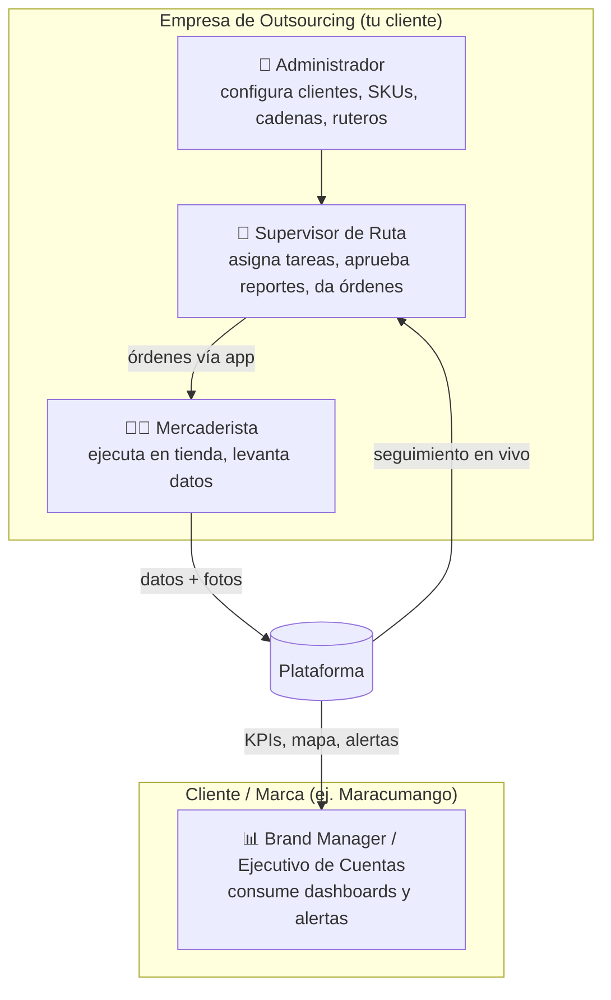

# 00 — Análisis del Proyecto

Volver a [[Market Track]] · Fuente: [[APP de levantamiento]]

## Qué es

**Market Track** es una plataforma de **ejecución en punto de venta (Retail Execution / SFA — Sales Force Automation)** para una **empresa de outsourcing de mercaderismo** que opera en el retail peruano. La empresa pone mercaderistas (reponedores) en cadenas como Plaza Vea, Tottus, Metro o Wong para representar marcas de consumo masivo (en el documento, la marca ficticia "Maracumango"; clientes reales del tipo Nestlé, Alicorp, Backus).

El software persigue tres objetivos de negocio simultáneos:

1. **Controlar al personal en campo** (asistencia georreferenciada, evidencia fotográfica, horas extras).
2. **Capturar datos de valor comercial** para la marca-cliente (quiebres de stock, Share of Shelf, precios, promociones, exhibiciones, mermas, vencimientos).
3. **Blindar legalmente** a la empresa de outsourcing frente a SUNAFIL (jornada laboral real, autonomía de mando, herramientas propias).

> Es, a la vez, una herramienta de **control laboral**, una **fábrica de datos comerciales** y un **argumento de venta para ganar licitaciones**.

---

## Problema que resuelve

| Dolor actual | Cómo lo resuelve la plataforma |
|---|---|
| No se sabe si el mercaderista realmente fue a la tienda | Check-in con **geocerca** (< 50 m) + selfie con marca de agua de hora/coordenadas; bloqueo de galería (solo cámara en vivo) |
| Reportes en papel / WhatsApp, sin trazabilidad | Captura estructurada y secuencial en la app, imposible saltarse pasos |
| La marca se entera tarde de un quiebre de stock | **Alertas automáticas** en tiempo real (email/WhatsApp) al ejecutivo de cuentas |
| Sin señal en sótanos de supermercados | **Modo offline** que guarda todo localmente y sincroniza al recuperar señal |
| Mermas y vencimientos sin documentar → la marca asume la pérdida | Módulos de **mermas tipificadas** y **alertas PVPS** (semáforo de vencimiento) |
| Riesgo de multa SUNAFIL por "desnaturalización" | Control de jornada automático, autonomía de mando vía supervisor, herramientas propias |

---

## Actores del sistema

- **Mercaderista** (app móvil): el operario en tienda. Marca ingreso/salida, repone, levanta datos, sube fotos. Trabaja **offline** gran parte del día.
- **Supervisor de ruta** (panel de gestión): controla varias rutas/mercaderistas. Diseña ruteros, asigna tareas, aprueba/rechaza reportes, es el **único** que da órdenes al mercaderista (candado SUNAFIL).
- **Administrador** (panel de gestión): rol interno de la empresa de outsourcing. Da de alta clientes-marca, SKUs, cadenas, tiendas, precios regulares, promociones y exhibiciones negociadas (la "pre-carga").
- **Cliente / Brand Manager** (portal web): la marca que paga el servicio. **No opera**, solo consume: dashboard en tiempo real, mapa de pines, KPIs, fotos, alertas y reportes exportables.

> **Multi-tenant:** una sola plataforma sirve a varios clientes-marca a la vez. Cada marca solo ve sus propios datos, tiendas y mercaderistas asignados. Esto es central para el modelo (la empresa de outsourcing tiene varias cuentas a la vez).

---

## Alcance funcional (del documento base)

### Flujo del día del mercaderista (7 fases)
Despertar/EPP → traslado/ingreso → trastienda/in-store → **levantamiento** → refrigerio/2.ª tienda → reporte final → retorno. El software cubre desde el **check-in** hasta el **check-out**, pasando por todo el levantamiento.

### Módulos núcleo
1. **Check-in** — geocerca, selfie con watermark, marcación de jornada.
2. **Levantamiento de información** (secuencial, sin saltos):
   - 2.1 Foto "Antes" + **Share of Shelf** (facings vs competencia).
   - 2.2 **Quiebres / OSA** (stock en sistema vs piso).
   - 2.3 **Precios y promociones** con motor de alertas de desviación.
   - 2.4 **Material POP, exhibiciones negociadas y adicionales**.
   - 2.5 Foto "Después".
3. **Check-out** — validación de tareas pendientes, bitácora, GPS, modo tránsito.

### Módulos transversales
- **Mermas** (tipificación, evidencia, cargo digital al retail).
- **Vencimientos PVPS / FEFO** (semáforo verde/ámbar/rojo por lote).
- **Cumplimiento SUNAFIL** (autonomía de mando, herramientas propias, corte automático de jornada).
- **Comunicación interna** (comunicados, confirmación de lectura, capacitaciones).
- **Reportería para clientes** (dashboard, KPIs, export, alertas email/WhatsApp).

Ver el desglose técnico en [[04 - Módulos y Funcionalidades]].

---

## KPIs del producto (qué mide el éxito)

El propio cliente lo advierte: al mercaderista **no se le mide por la venta final** (el retail maneja sus propias compras), sino por **KPIs de ejecución**:

- **% de cumplimiento de rutero** (visitas planificadas vs realizadas).
- **% de quiebres reportados** (OSA — On Shelf Availability).
- **Share of Shelf** (participación de góndola en facings/cm).
- **Exhibiciones ganadas / cumplidas** vs negociadas.
- **Efectividad de precios** (desviaciones detectadas y corregidas).
- **Tiempo en tienda** y **tiempo de traslado** (optimización de ruteros).

---

## Restricciones y supuestos críticos

| # | Restricción | Implicación técnica/comercial |
|---|---|---|
| 1 | **Offline obligatorio** (sótanos sin señal) | Arquitectura **offline-first** real, no un cache opcional. Es el #1 diferenciador. |
| 2 | **Anti-fake-GPS** | Geocerca con PostGIS + validación de integridad; fotos solo de cámara en vivo. |
| 3 | **Volumen de fotos alto** | 30–50 mercaderistas × ~20–40 fotos/día → decenas de GB/mes. Comprimir en cliente + storage barato (R2). |
| 4 | **Gama media Android** | Los mercaderistas usan equipos económicos; la app debe ser ligera y tolerante a equipos lentos. |
| 5 | **Marco legal peruano** | SUNAFIL, Ley 29245, SCTR, 45 min de refrigerio, 8h/48h. El producto **vende** este blindaje. |
| 6 | **Multi-tenant** | Aislamiento de datos por cliente-marca desde el día 1 (RLS). |
| 7 | **Alcance MVP estricto** | Solo entra lo marcado ✅ en [[04 - Módulos y Funcionalidades]]. La disciplina de alcance viene del **producto**, no de una fecha: el proyecto se entrega cuando está terminado. |
| 8 | ~~Plazo y presupuesto~~ | **No son restricciones de desarrollo.** Las fechas ([[05 - Fases de Desarrollo]]) y las cifras ([[06 - Análisis de Costos y Cobro]]) son información de guía: no deciden alcance, prioridad de tickets ni decisiones técnicas. |

---

## Análisis competitivo (referencias del documento)

| Competidor | Qué es | Dónde ganarles |
|---|---|---|
| **Repsly** | SaaS global de retail execution | Precio en USD alto; tu propuesta local en soles + soporte cercano + offline robusto |
| **Teamcore** | Plataforma de quiebres con IA (Chile/LATAM) | Enfocado en grandes marcas; tu nicho es la **empresa de outsourcing** y su control laboral SUNAFIL |
| **Apps propias / Excel / WhatsApp** | Lo que muchas usan hoy | Estructura, trazabilidad y alertas automáticas |

**Posicionamiento:** no competir como "otro SaaS de mercaderismo", sino como la herramienta que **gana licitaciones** combinando datos comerciales + control laboral SUNAFIL + offline real, hecha a la medida de la operación peruana.

---

## Riesgos del proyecto

| Riesgo | Impacto | Mitigación |
|---|---|---|
| Offline-first mal resuelto (conflictos de sync, fotos perdidas) | **Alto** | Usar motor probado (PowerSync/WatermelonDB), no inventar sync; pruebas en campo reales |
| Presupuesto no alcanza para el alcance esperado | **Alto** | Alcance del piloto cerrado por contrato; módulos avanzados como fases pagadas |
| Plazo de noviembre con un solo dev | **Alto** | MVP estricto + Claude Code; contratado puntual solo para UI/QA si aprieta |
| Costos de storage de fotos crecen | Medio | Compresión en cliente + Cloudflare R2 + políticas de retención |
| Aprobación WhatsApp Business API tarda | Medio | Email en MVP; WhatsApp en fase posterior |
| IA de Share of Shelf incierta/cara | Medio | Conteo manual en MVP; IA como fase 2 pagada |
| Cambios de requisitos del cliente | Alto | Documento de alcance firmado; control de cambios por escrito |

---

⬅ [[Market Track]] · Siguiente: [[01 - Stack Tecnológico]]
