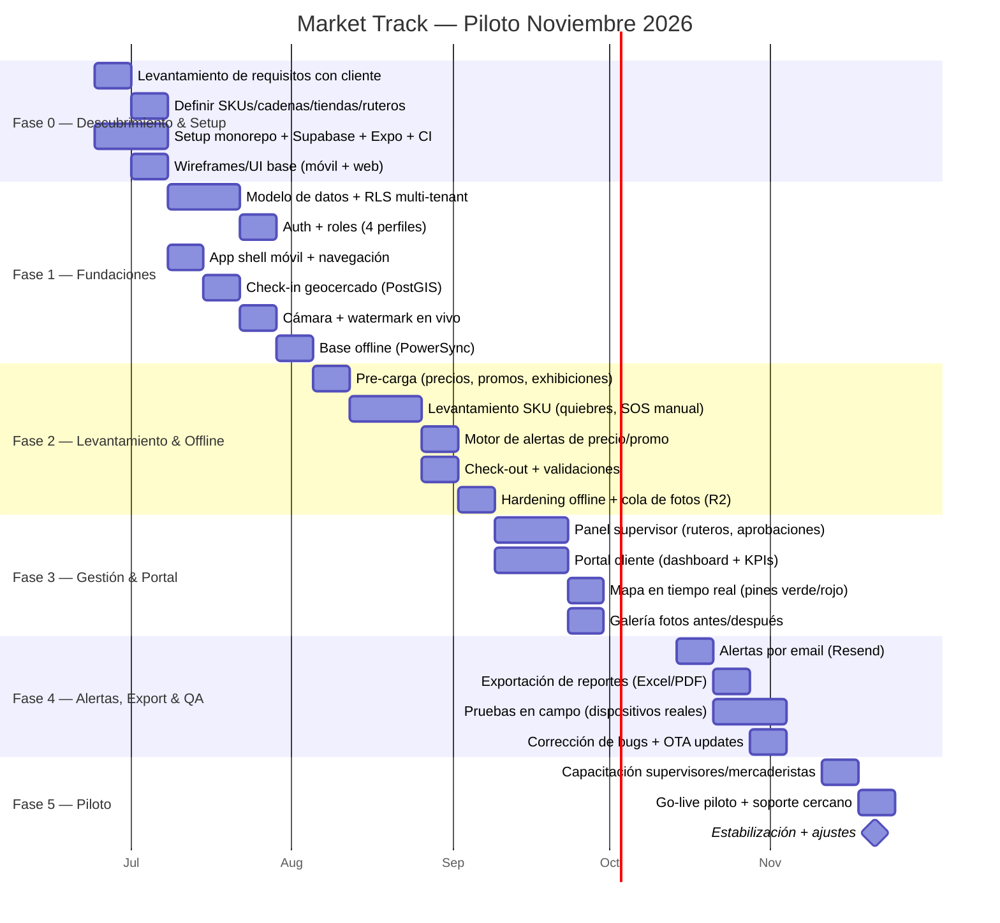
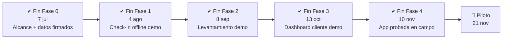

# 05 — Fases de Desarrollo

Volver a [[Market Track]]

> [!warning] Las fechas de este documento son informativas y NO vinculantes
> El proyecto **se entrega cuando está terminado, no cuando toca**. El calendario, la ventana de semanas y la fecha de piloto que aparecen abajo son **información de guía para el developer** — no se usan para decidir el alcance, priorizar tickets, recortar calidad ni justificar una decisión técnica. La fecha puede variar mucho, y eso está previsto.
>
> Lo que sí es vinculante de este documento es el **orden de las fases**, porque es una cadena de dependencias técnicas reales: no hay check-in geocercado sin auth, ni auth sin RLS, ni RLS sin modelo de datos.
>
> El alcance lo fija [[04 - Módulos y Funcionalidades]] (solo lo ✅).

> **Propuesta v1 — para cerrar juntos.** Plan para llegar a un **piloto operativo con 1 cliente real (20–50 mercaderistas)**, desarrollado por Diego + Claude Code. Alcance = MVP de [[04 - Módulos y Funcionalidades]].

## Marco temporal

- **Hoy:** 18 de junio de 2026.
- **Arranque efectivo:** ~24 de junio de 2026.
- **Meta de piloto:** ~21 de noviembre de 2026.
- **Ventana:** ~22 semanas (~5 meses).
- **Productividad asumida:** 1 dev + Claude Code ≈ **2,5–3×** un dev solo (tu mismo supuesto en [[Sandia/Corporativo/Plan-Sandia/11-Plan-Solo-Developer]]).

---

## Roadmap (Gantt)

---

## Resumen de fases

| Fase | Foco | Duración | Periodo | Entregable |
|---|---|---|---|---|
| **0** | Descubrimiento + setup técnico | 2 sem | 24 jun – 7 jul | Repos, infra, datos del cliente, wireframes |
| **1** | Fundaciones (datos, auth, check-in, offline base) | 4 sem | 8 jul – 4 ago | Mercaderista puede hacer check-in geocercado offline |
| **2** | Levantamiento + offline robusto + check-out | 5 sem | 5 ago – 8 sep | Levantamiento completo funcionando offline |
| **3** | Panel gestión + portal cliente + dashboard | 4 sem | 9 sep – 13 oct | Supervisor y cliente ven datos y mapa en vivo |
| **4** | Alertas, export, pruebas en campo, bugs | 4 sem | 14 oct – 10 nov | Alertas email + reportes + app probada en campo |
| **5** | Capacitación + go-live piloto | 2 sem | 11 nov – 21 nov | **Piloto operando con cliente real** |
| | | **~21 sem** | | |

> Hay ~1 semana de **colchón** antes del 30 de noviembre para imprevistos. Realista pero **sin margen para crecer el alcance** — de ahí la importancia del corte MVP de [[04 - Módulos y Funcionalidades]].

---

## Hitos de control (checkpoints con el cliente)

Cada checkpoint = **demo + visto bueno del cliente**. Sirve para controlar cambios de alcance (todo lo nuevo se cotiza aparte) y para cobrar por hitos si se acuerda pago fraccionado.

---

## Estrategia de ejecución (solo dev + Claude Code)

1. **Sprints de 2 semanas** alineados a las fases.
2. **MVP estricto**: si algo no está en [[04 - Módulos y Funcionalidades]] como ✅, no entra al piloto.
3. **Claude Code para lo repetitivo**: CRUD, migraciones, tipos, formularios del levantamiento, tests, componentes de dashboard.
4. **Tú decides** lo crítico: arquitectura offline, geocercas, UX del mercaderista en campo, resolución de conflictos.
5. **Pruebas en campo temprano** (Fase 4 dedicada): el offline solo se valida en un sótano real, no en el emulador.
6. **OTA updates (Expo EAS)** para parchar la app durante el piloto sin pasar por la tienda.
7. **No perfeccionar, iterar**: versión funcional por sprint.

### ¿Dónde podría entrar un contratado?
Solo si el plazo aprieta y el presupuesto lo permite (ver [[06 - Análisis de Costos y Cobro]]): tareas **acotadas y paralelizables** —diseño UI del portal, maquetación de dashboards, QA de la Fase 4— **no** el núcleo offline (ese lo controlas tú). Con el presupuesto actual, lo más probable es **recortar alcance antes que contratar**.

---

## Riesgos del cronograma

| Riesgo | Mitigación |
|---|---|
| Offline-first toma más de lo previsto | Es la Fase 1–2; si se atrasa, se recorta levantamiento, no el offline |
| Datos del cliente (SKUs, ruteros) llegan tarde | Bloquear Fase 0 hasta tenerlos; es prerrequisito |
| Dedicación part-time (otras empresas) | Proteger bloques de tiempo; el Gantt asume ~25–30 h/sem efectivas |
| Cambios de alcance del cliente | Checkpoints + control de cambios por escrito |
| Pruebas en campo revelan problemas graves | Fase 4 con 2 semanas dedicadas + colchón de noviembre |

---

## Pendiente de cerrar contigo

- [ ] ¿Dedicación real semanal al proyecto? (ajusta el Gantt)
- [ ] ¿Mermas / PVPS entran al piloto o van a Fase 2? (hoy: Fase 2)
- [ ] ¿WhatsApp lo exige el cliente piloto? (hoy: solo email)
- [ ] ¿Pago por hitos o 50/50? (ver [[06 - Análisis de Costos y Cobro]])

---

⬅ [[04 - Módulos y Funcionalidades]] · Siguiente: [[06 - Análisis de Costos y Cobro]]
