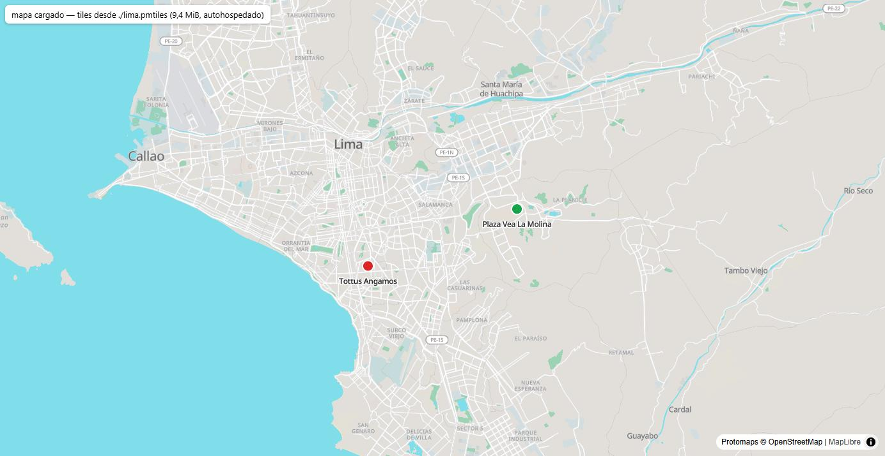

# ADR-0009 — Los tiles de los mapas se autohospedan en R2 con Protomaps (PMTiles)

- **Estado:** aceptado
- **Fecha:** 2026-07-16
- **Reemplaza a:** —

## Contexto

`docs/01 - Stack Tecnológico.md` eligió MapLibre "para evitar costo por carga de
mapa". **El razonamiento estaba equivocado, no incompleto.**

MapLibre GL es un **renderizador, no un proveedor de mapas**: no incluye los
tiles. Elegir MapLibre sobre Mapbox no elimina el costo del mapa — lo mueve al
proveedor de tiles, que sigue habiendo que escoger, pagar o autohospedar. Un
MapLibre sin tiles es un lienzo gris.

Dónde hace falta un mapa, según el alcance (`docs/04`, solo lo ✅):

- **Tablero del supervisor** — mapa de visitas en vivo con pines verde/rojo.
- **Portal del cliente** — dashboard de KPIs con mapa de pines.
- **Maestros del panel** — la tienda y su geocerca.

**El móvil NO lleva mapa.** Se revisó el Módulo 1 entero: sus ✅ son "selección
de tienda del rutero", geocerca y selfie con watermark. La geocerca es un
cálculo de distancia contra `tienda.radio_geocerca_m`, no una pantalla de mapa.
Ningún ✅ del móvil pide tiles — y es coherente con el producto: un mapa en un
sótano sin señal exigiría además tiles offline. **Este ADR aplica solo a la web.**

Quien abre un mapa es un puñado de personas (supervisores y brand managers), no
los 20–50 mercaderistas del piloto: el volumen es de miles de cargas al mes.

## Opciones consideradas

Precios y términos **verificados en fuente oficial el 16 jul 2026**.

| Opción | A favor | En contra |
|---|---|---|
| **A. Protomaps (PMTiles) autohospedado en R2** (elegida) | R2 **ya está en el stack** por las fotos: cero proveedores nuevos, cero API keys, cero contadores. **R2 no cobra egreso**, solo por petición. Un archivo único servido por HTTP range requests, sin servidor delante. Datos OSM bajo ODbL: uso comercial libre con atribución. Sin límite que pueda suspender el mapa en producción | Los datos **no se actualizan solos**: hay que rehacer el extracto cada cierto tiempo. Cloudflare documenta que R2 tiene **latencia más alta (500 ms o más)** que otros object storage. Trabajo de ops propio |
| B. Mapbox + MapLibre | Free tier sin restricción de uso comercial; cartografía muy buena; cero ops | **Con un renderizador de terceros, el free tier de 50.000 map loads NO aplica**: se factura por *tile request* (200.000/mes gratis, luego $0,25/1k). El piloto **roza** ese límite, y el segundo cliente lo cruza. Un contador ajeno en la ruta crítica del dashboard |
| C. MapTiler | Esfuerzo bajo, buena cobertura | **Descartada por licencia, no por precio.** Sus Cloud Terms limitan el plan gratuito a uso **no comercial** e I+D. Market Track en producción es un producto comercial: el free tier **no es legalmente viable**. El primer plan de pago son $30/mes, y al pasarse cualquier cuota *"your maps get suspended for the rest of the month"* |
| D. OSM raster autohospedado | Control total | Infraestructura propia (servidor de render, base de datos, actualizaciones). Todo el coste de ops de la opción A, multiplicado, y sin sus ventajas |

## Decisión

**Los tiles se autohospedan: un extracto de Perú en formato PMTiles, servido
desde Cloudflare R2 por range requests, renderizado con MapLibre GL.**

## Lo que se midió

El tamaño de un extracto por país no lo publica nadie — Protomaps no da cifras
por región y las que circulan en blogs no son fuente. Se midió contra el build
del planeta (`https://build.protomaps.com/20260715.pmtiles`, ~120 GB) con
`pmtiles extract`, que lee el planeta **remoto** por range requests y solo baja
el trozo pedido:

| Extracto | Tamaño | Coste de almacenamiento en R2 |
|---|---|---|
| Lima, z0–14 | **9,4 MiB** | despreciable |
| Perú entero, z0–14 | **391 MB** | ~$0,006/mes |
| Perú entero, z0–15 (zoom máximo del planeta) | **799 MB** | **~$0,012/mes** |

Perú entero al máximo zoom cabe en 0,8 GB y entra de sobra en los **10 GB
gratis** de R2. Construir el extracto de Lima costó **14 segundos y 32
peticiones** al planeta remoto.

**Coste proyectado al volumen del piloto: efectivamente cero.** Aunque cada range
request se facturase como una operación Clase B —lo que Cloudflare no documenta
explícitamente—, el orden de magnitud del piloto (cientos de miles de peticiones
al mes) es un ~2% del free tier de **10 millones** de Clase B/mes. El egreso, que
es lo que dispara la factura en otros object storage, **R2 no lo cobra**.

Se verificó de punta a punta con un mapa de Lima renderizando los pines de las
dos tiendas del seed, con sus geocercas, desde el archivo autohospedado:



La cartografía de Lima es de calidad de sobra para pines de tiendas: nombres a
nivel de barrio y calle, Callao, el Rímac y las vías principales.

## Consecuencias

**Lo que ganamos.** El mapa deja de tener dueño externo: no hay API key que
rotar, ni cuota que vigilar, ni un tercero que pueda suspender el dashboard del
cliente a mitad de mes. El coste es de céntimos y no crece con el uso, porque R2
no cobra egreso. Y no entra ningún proveedor nuevo al stack: R2 ya estaba ahí
por las fotos.

**Lo que aceptamos a cambio.**

- **Los datos se quedan viejos.** Nadie los refresca solo. Una tienda nueva en
  una avenida nueva puede no aparecer en el mapa base hasta que se rehaga el
  extracto. Para pines de tiendas esto es irrelevante — las coordenadas son
  nuestras, no de OSM —, pero hay que saberlo.
- **Trabajo de ops propio**: regenerar el extracto y subirlo a R2. No está
  automatizado; hoy es un comando manual documentado.
- **Latencia.** Cloudflare documenta que R2 tiene latencia más alta (500 ms o
  más) que otros object storage. El camino con Worker + caché de Protomaps
  existe si molesta, pero **no se implementa ahora**: exige un dominio propio en
  Cloudflare y no hay evidencia todavía de que haga falta.
- **La atribución es obligatoria** y no es decorativa: los datos son OSM bajo
  ODbL. `Protomaps © OpenStreetMap` tiene que ser visible en todo mapa.

**Cómo lo sabríamos si nos equivocamos.** Si el mapa tarda tanto en pintar que
el supervisor lo percibe lento (la latencia de R2 mordiendo de verdad), o si el
extracto de Perú deja de caber cómodamente en el free tier de R2 al crecer el
número de clientes. La primera señal se ataja con el Worker + caché; la segunda
son céntimos y no cambiaría la decisión. Lo que **sí** la invalidaría es
necesitar datos frescos de forma continua — ahí un proveedor gestionado vuelve a
ganar.

## Cómo se construye el extracto

Con la imagen oficial del CLI, sin instalar nada. Lee el planeta remoto y baja
solo la región pedida:

```sh
docker run --rm -v "$PWD:/salida" protomaps/go-pmtiles:latest extract \
  https://build.protomaps.com/20260715.pmtiles /salida/peru.pmtiles \
  --bbox=-81.4,-18.4,-68.6,-0.03 --maxzoom=15
```

`--dry-run` calcula el tamaño sin descargar nada — así se midieron las cifras de
arriba.

El bucket de R2 necesita **CORS** (`GET`/`HEAD`, headers `range` e `if-match`,
exponer `etag`): sin CORS los range requests fallan desde el navegador. Del lado
del cliente, `pmtiles` registra el protocolo en MapLibre y la fuente apunta al
archivo con **URL absoluta** (`pmtiles://` no resuelve rutas relativas):

```js
maplibregl.addProtocol("pmtiles", new Protocol().tile);
// sources: { protomaps: { type: "vector", url: `pmtiles://${URL_DEL_ARCHIVO}` } }
// layers: layers("protomaps", namedFlavor("light"), { lang: "es" })
```

Versiones verificadas al decidir: `maplibre-gl` 5.24.0, `pmtiles` 4.4.1,
`@protomaps/basemaps` 5.7.2.
