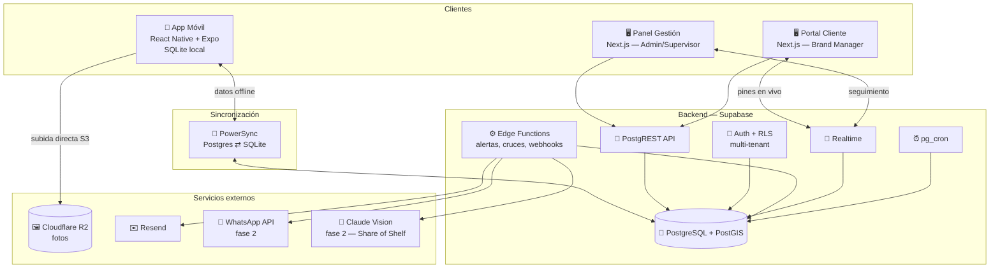
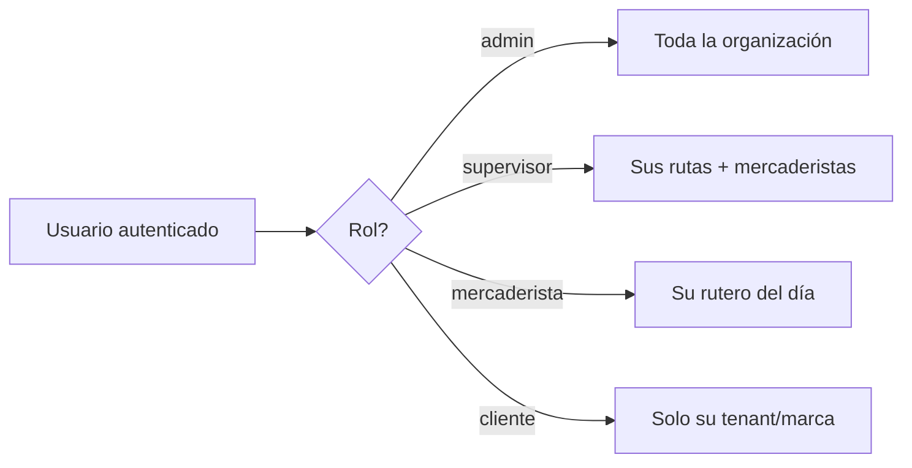
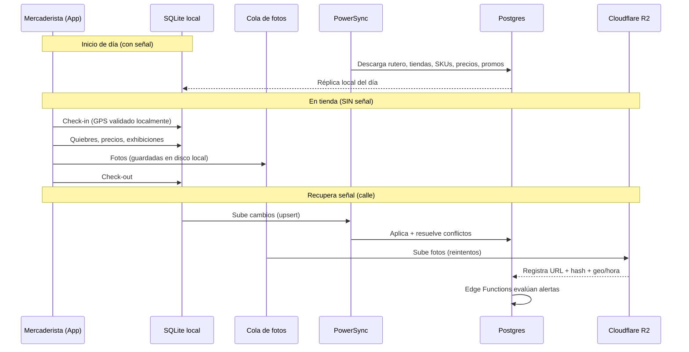
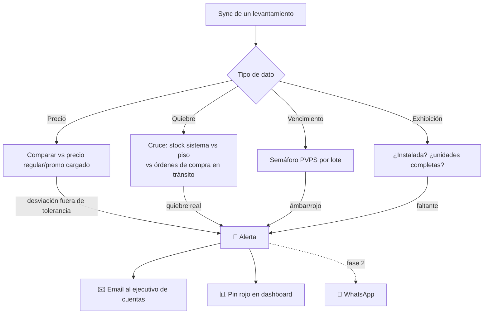

# 02 — Arquitectura Técnica

Volver a [[Market Track]] · Stack: [[01 - Stack Tecnológico]]

## Vista general

Tres clientes (móvil, panel de gestión, portal cliente) hablan con un **backend único** (Supabase/Postgres) a través de una **API** (PostgREST + Edge Functions). El móvil además mantiene una **réplica local** sincronizada por PowerSync para operar offline. Las fotos viajan por un canal aparte hacia Cloudflare R2.



---

## Multi-tenancy y seguridad

- **Modelo:** un solo esquema, aislamiento por **`tenant_id` (cliente-marca)** + **RLS** en Postgres.
- Cada fila (tienda, SKU, visita, foto…) lleva su `tenant_id`. Las políticas RLS garantizan que:
  - El **Brand Manager** solo lee filas de su marca.
  - El **mercaderista** solo ve su rutero y las tiendas/SKUs asignados.
  - El **supervisor** ve sus rutas; el **admin** de la empresa de outsourcing ve todo dentro de la organización.
- **Roles** (en `auth` + tabla `profiles.role`): `admin`, `supervisor`, `mercaderista`, `cliente`.
- ⚠️ **RLS protege a PostgREST (web), no necesariamente al móvil.** Un motor de sincronización como PowerSync se conecta a Postgres con **sus propias credenciales** y aplica **sus** *sync rules*: no ejecuta las políticas RLS. El aislamiento multi-tenant del móvil vive, por tanto, en una **segunda superficie de seguridad**. Ver [ADR-0001](adr/0001-motor-offline-dedicado.md) — es lo que el spike del motor offline debe cerrar.
- **Autenticación:** usuario/contraseña + **segundo factor**. El **correo** es el canal por defecto (compromiso de la propuesta aceptada); **SMS y WhatsApp** se suman como canales habilitables desde el panel (`configuracion_plataforma.otp_canales_habilitados`).
- **Acceso de emergencia:** el usuario que no recibe su OTP por ningún canal se desbloquea con un **pase de acceso temporal** emitido desde el panel — código de un solo uso, 15 minutos de vida, motivo obligatorio y auditoría de quién lo emitió. No existe un interruptor de "desactivar el 2FA a este usuario": un permiso así se queda encendido para siempre.
- Las **fotos en R2** se sirven con **URLs firmadas** de expiración corta (no públicas), generadas por Edge Function validando el rol.



---

## Flujo offline-first (caso crítico)

El mercaderista pasa horas sin señal en el sótano. La app debe ser **100% funcional offline** y sincronizar al recuperar conexión.



**Puntos finos:**
- La **geocerca** se valida localmente con las coordenadas de la tienda (pre-descargadas) + lectura GPS. La integridad anti-*fake-GPS* se refuerza en servidor al sincronizar (timestamp del servidor, coherencia de coordenadas).
- Las **fotos** llevan watermark grabado en el pixel **en el momento de la captura** (hora + coordenadas + usuario), no después → la evidencia es válida aunque se suba horas más tarde.
- **Resolución de conflictos:** el levantamiento es por (mercaderista, tienda, fecha); raramente colisiona. Estrategia *last-write-wins* por campo + log de auditoría.

---

## Motor de alertas (Edge Functions)

Al sincronizar, se disparan validaciones de servidor que generan **alertas** al cliente:



La **tolerancia de desviación** (cuánto puede variar un precio antes de alertar) es **configurable por marca** — parámetro pre-cargado, según pide el documento.

**Alertas de contingencia (bypass):** cuando el mercaderista salta un paso por causa externa, el registro `contingencia` genera al sincronizar una `alerta` tipo `contingencia` dirigida al **panel del supervisor en tiempo real** (Supabase Realtime), no al cliente-marca. Si la visita ocurre offline, la alerta se dispara al recuperar señal — "tiempo real" significa *al momento del sync*, y así debe comunicarse.

---

## Estructura del repositorio (monorepo)

```
market-track/                (Turborepo)
├─ apps/
│  ├─ mobile/                Expo (React Native) — mercaderista
│  └─ web/                   Next.js 15 — admin/supervisor/cliente
├─ packages/
│  ├─ db/                    schema SQL, migraciones, tipos generados (Supabase)
│  ├─ shared/                tipos, validadores Zod, lógica de dominio compartida
│  ├─ sync/                  reglas y config de PowerSync
│  └─ ui/                    componentes compartidos (donde aplique)
├─ supabase/
│  ├─ migrations/
│  └─ functions/             Edge Functions (alertas, webhooks, IA)
└─ turbo.json
```

> Un **monorepo Turborepo** permite que móvil y web compartan tipos generados desde el esquema de Supabase y la lógica de validación (Zod) → menos bugs, una sola fuente de verdad.

---

## Decisiones de arquitectura

Cada decisión vive en su propio ADR, con el contexto, las alternativas
descartadas y las consecuencias. **La fuente de verdad es el registro**
([`docs/adr/`](adr/README.md)); esta tabla es solo un índice.

| ADR | Decisión | Estado |
|---|---|---|
| [0001](adr/0001-motor-offline-dedicado.md) | Offline-first con un motor de sincronización dedicado (PowerSync) | **propuesto** — lo valida el spike del motor offline |
| [0002](adr/0002-multi-tenant-por-rls.md) | Multi-tenant por RLS, no por BD separada | aceptado |
| [0003](adr/0003-fotos-en-r2-metadata-en-postgres.md) | Fotos en R2, metadata en Postgres | aceptado |
| [0004](adr/0004-una-web-por-rol.md) | Una web para los tres roles, no apps separadas | aceptado |
| [0005](adr/0005-ia-de-share-of-shelf-fuera-del-mvp.md) | IA de Share of Shelf fuera del MVP | aceptado |
| [0006](adr/0006-watermark-en-captura.md) | Watermark en la captura, no en la subida | aceptado |
| [0007](adr/0007-catalogos-y-tolerancias-precargados.md) | Catálogos y tolerancias pre-cargados por marca | aceptado |

---

⬅ [[01 - Stack Tecnológico]] · Siguiente: [[03 - Modelo de Datos]]
