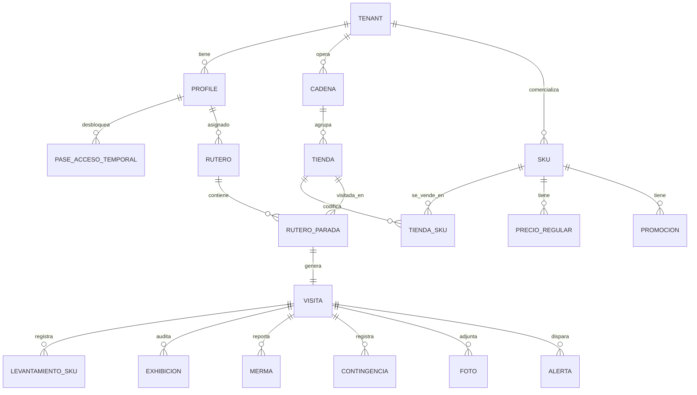

# 03 — Modelo de Datos

Volver a [[Market Track]] · Arquitectura: [[02 - Arquitectura Técnica]]

> Esquema relacional sobre **PostgreSQL** (Supabase). Todas las tablas de negocio llevan `tenant_id` para el aislamiento multi-tenant por cliente-marca. Las geometrías usan **PostGIS**.

## Diagrama entidad-relación (núcleo)

---

## Entidades principales

### Organización y usuarios

**`tenant`** — cliente-marca (ej. Maracumango). Aísla todos los datos.
| Campo | Tipo | Nota |
|---|---|---|
| id | uuid PK | |
| nombre | text | "Maracumango" |
| tolerancia_precio_pct | numeric | desviación de precio tolerada |
| activo | bool | |

**`profile`** — usuario (extiende `auth.users`).
| Campo | Tipo | Nota |
|---|---|---|
| id | uuid PK (= auth.uid) | |
| rol | enum | `admin` \| `supervisor` \| `mercaderista` \| `cliente` |
| tenant_id | uuid FK | null para admin/supervisor de la outsourcing |
| nombre, dni, telefono | text | `telefono` pasa a ser **obligatorio** si el usuario usa OTP por SMS/WhatsApp |
| telefono_verificado_at | timestamptz | un teléfono sin verificar no puede recibir el segundo factor |
| sctr_vigente_hasta | date | blindaje SUNAFIL |
| supervisor_id | uuid FK | a quién reporta el mercaderista |

### Autenticación y acceso de emergencia

Añadido tras la revisión con el cliente (jul 2026): el segundo factor deja de
ser solo correo y aparece un mecanismo para desatascar al mercaderista que no
recibe su código.

**`configuracion_plataforma`** — ajustes globales de la operación de la
outsourcing (fila única). No lleva `tenant_id`: el mercaderista tiene **un solo
login** aunque atienda varias marcas, así que el 2FA no puede configurarse por
cliente-marca.
| Campo | Tipo | Nota |
|---|---|---|
| id | bool PK | singleton (`CHECK (id)`) |
| otp_requerido | bool | default `true` — el interruptor global de 2FA |
| otp_canales_habilitados | text[] | subconjunto de `{correo, sms, whatsapp}`; default `{correo}` (el correo es lo que fija la propuesta aceptada) |

**`pase_acceso_temporal`** — desbloqueo puntual de un usuario que no recibe su
OTP por ningún canal. Reemplaza a la idea de "desactivarle el 2FA a ese
usuario": un interruptor por usuario tiende a quedarse encendido para siempre y
se convierte en una puerta abierta permanente.
| Campo | Tipo | Nota |
|---|---|---|
| id | uuid PK | |
| profile_id | uuid FK | a quién se le concede |
| codigo_hash | text | **hash**, nunca el código en claro |
| motivo | text | obligatorio — queda en la auditoría |
| generado_por | uuid FK | admin o supervisor que lo emitió |
| generado_at | timestamptz | |
| expira_at | timestamptz | default `now() + 15 min` |
| usado_at | timestamptz | null hasta el canje; **un solo uso** |
| revocado_at | timestamptz | anulación manual |

RLS: el admin emite pases para cualquiera; el supervisor, **solo para los
mercaderistas que le reportan** (`profile.supervisor_id = auth.uid()`). Nadie
lee `codigo_hash`. Cada emisión y cada canje se registran como eventos de
auditoría, y una sesión iniciada con pase queda marcada como tal.

### Maestro comercial (pre-carga)

**`cadena`** — retail (Plaza Vea, Tottus…). `id, tenant_id, nombre, tipo_tienda`.

**`tienda`** — punto de venta físico.
| Campo | Tipo | Nota |
|---|---|---|
| id | uuid PK | |
| cadena_id, tenant_id | uuid FK | |
| nombre | text | "Plaza Vea Higuereta" |
| direccion | text | |
| ubicacion | geography(Point) | **PostGIS** — centro de geocerca |
| radio_geocerca_m | int | **default 100** (revisión con el cliente, jul 2026); editable por tienda |
| cluster | text | para promociones por cluster |

**`sku`** — producto del cliente. `id, tenant_id, codigo, nombre, presentacion, ean/codigo_barras, activo`.

**`tienda_sku`** — qué SKUs están **codificados** en cada tienda (la "lista exacta" por tienda que pide el documento). `tienda_id, sku_id, activo`.

**`precio_regular`** — precio regular por SKU / cadena / tipo de tienda. `sku_id, cadena_id, tipo_tienda, precio, vigente_desde`.

**`promocion`** — promo pre-cargada. `sku_id, precio_promo, fecha_inicio, fecha_fin, clusters[], comunicada(bool)`.

**`exhibicion_negociada`** — cabecera, isla, ruma negociada. `tienda_id, sku_ids[], tipo, cantidad_sugerida, fecha_inicio, fecha_fin`.

### Operación (ruteros y visitas)

**`rutero`** — plan del día de un mercaderista. `id, mercaderista_id, fecha, estado`.

**`rutero_parada`** — cada tienda del rutero, ordenada. `rutero_id, tienda_id, orden, estado`.

**`visita`** — ejecución real en una tienda (núcleo transaccional).
| Campo | Tipo | Nota |
|---|---|---|
| id | uuid PK | |
| rutero_parada_id, mercaderista_id, tienda_id, tenant_id | FK | |
| check_in_at | timestamptz | hora de servidor |
| check_in_geo | geography(Point) | validación geocerca |
| selfie_foto_id | uuid FK | foto de ingreso con watermark |
| check_out_at | timestamptz | |
| estado | enum | `en_curso`\|`completada`\|`bloqueada` |
| bitacora | text | comentarios libres del check-out |
| tiempo_traslado_min | int | modo tránsito |

### Levantamiento

**`levantamiento_sku`** — datos por SKU en una visita.
| Campo | Tipo | Nota |
|---|---|---|
| visita_id, sku_id | FK | |
| frentes_propios | int | Share of Shelf **por SKU** (manual en MVP) |
| frentes_competencia | jsonb | `[{marca, frentes}]` |
| sos_foto_id | uuid FK | foto **opcional** del frente de ese SKU |
| stock_sistema | int | unidades en sistema |
| stock_piso | int | góndola + exhibiciones + trastienda |
| quiebre | bool | derivado — `stock_piso = 0 AND stock_sistema > 0` |
| diferencia | bool | derivado — `stock_piso > 0 AND stock_piso <> stock_sistema` |
| precio_registrado | numeric | precio digitado hoy |
| hay_promo, promo_comunicada | bool | flujo de preguntas del documento |

> **Quiebre y diferencia son excluyentes por construcción:** el quiebre exige
> piso = 0 y la diferencia exige piso > 0, así que un SKU nunca lleva los dos
> flags. Ambos se calculan en la misma vista/trigger — nunca en las apps.

**Share of Shelf agregado de la góndola** — convive con el detalle por SKU
(decisión de la revisión con el cliente, jul 2026): el mercaderista registra el
total de la góndola *y* el desglose por SKU. Vive como columnas de `visita`
(relación 1:1, no justifica tabla propia): `sos_frentes_propios` (int),
`sos_frentes_competencia` (jsonb `[{marca, frentes}]`), `sos_foto_id` (uuid FK,
opcional). El % de share es **derivado** — se calcula en vista, y la suma del
detalle por SKU permite cuadrar contra el agregado.

**`exhibicion`** — auditoría de exhibición en la visita. `visita_id, exhibicion_negociada_id (o tipo_adicional), instalada(bool), unidades, completa(bool), foto_id, vigente(bool)`.

**`contingencia`** — bypass de un paso del levantamiento (compromiso de la propuesta aceptada): cuando el mercaderista no puede completar una fase por causa externa, registra el hallazgo y continúa; dispara una alerta en tiempo real al supervisor.
| Campo | Tipo | Nota |
|---|---|---|
| visita_id, tenant_id | FK | |
| paso | enum | `foto_antes`\|`share_of_shelf`\|`quiebres`\|`precios`\|`exhibiciones`\|`foto_despues`\|`checkin`\|`checkout` |
| motivo | text | causa externa (sin acceso al almacén, información no disponible…) |
| foto_id | uuid FK | evidencia opcional del hallazgo |
| registrada_at | timestamptz | hora local de captura (sincroniza offline) |

**`merma`** — producto dañado.
| Campo | Tipo | Nota |
|---|---|---|
| visita_id, sku_id | FK | |
| tipo | enum | `manipulacion`\|`transporte`\|`vencimiento` |
| foto_id | uuid FK | código de barras + daño |
| recibido_por | text | nombre del encargado (cargo digital) |

**`lote_vencimiento`** — control PVPS/FEFO. `visita_id, sku_id, lote, fecha_vencimiento, dias_para_vencer (derivado), alerta_color (verde/ámbar/rojo)`.

### Evidencia y alertas

**`foto`** — toda imagen. `id, visita_id, tenant_id, tipo (selfie\|antes\|despues\|sos\|exhibicion\|merma\|precio), url_r2, hash, capturada_at, geo, subida_at`.

**`alerta`** — disparada por las Edge Functions.
| Campo | Tipo | Nota |
|---|---|---|
| id, tenant_id, visita_id | FK | |
| tipo | enum | `quiebre`\|`diferencia_stock`\|`desviacion_precio`\|`promo_no_activa`\|`vencimiento`\|`exhibicion_incompleta`\|`hora_extra`\|`contingencia` |
| severidad | enum | `info`\|`alta`\|`critica` |
| canal | enum | `dashboard`\|`email`\|`whatsapp` |
| estado | enum | `nueva`\|`vista`\|`resuelta` |
| payload | jsonb | detalle |

### Comunicación y laboral (fases posteriores)

- **`comunicado`** — mensajes a equipo, `confirmacion_lectura` por usuario.
- **`capacitacion`** — material formativo móvil.
- **`jornada`** — derivada de check-in/out para el corte automático 8h/48h y la **aprobación de horas extra** (candado SUNAFIL).

---

## Cómo el modelo soporta los flujos del documento

| Requisito del documento | Tablas que lo resuelven |
|---|---|
| Lista exacta de SKUs por tienda | `tienda_sku` |
| Quiebre = sistema vs piso, cruce con OC | `levantamiento_sku` (stock_sistema, stock_piso) + Edge Function |
| **Diferencia de stock** (piso > 0 pero ≠ sistema) | `levantamiento_sku.diferencia` (derivado) + `alerta` tipo `diferencia_stock` |
| **SOS agregado + detalle por SKU, con foto** | `visita.sos_*` + `levantamiento_sku.frentes_*` + `foto` tipo `sos` |
| **2FA multicanal (correo/SMS/WhatsApp), activable** | `configuracion_plataforma.otp_canales_habilitados` |
| **Mercaderista que no recibe su OTP** | `pase_acceso_temporal` (un solo uso, 15 min, auditado) |
| Alertas de desviación de precio | `precio_regular`, `promocion`, `tenant.tolerancia_precio_pct`, `alerta` |
| Promos por cluster y "comunicada" | `promocion.clusters`, `promo_comunicada` |
| Exhibiciones negociadas y adicionales | `exhibicion_negociada`, `exhibicion` |
| Exhibición "vive" en mercaderista y tienda | FK a ambos en `exhibicion`/`visita` (para incentivos y cambios de ruta) |
| Semáforo de vencimientos | `lote_vencimiento` + job `pg_cron` |
| Cargo digital de merma | `merma.recibido_por` + `foto` |
| Geocerca anti-fake-GPS | `tienda.ubicacion` (PostGIS) + `visita.check_in_geo` |
| Mecanismo de contingencia (bypass) con alerta al supervisor | `contingencia` + `alerta` (tipo `contingencia`, canal dashboard en tiempo real) |
| Corte de jornada / horas extra | `jornada` derivada de `visita` |

---

## Entidades añadidas tras el benchmark LiveTrade

Ver [[07 - Benchmark LiveTrade (Overall)]]. La plataforma de Overall revela conceptos que conviene incorporar:

**`campania`** — agrupador de operación/reportes por cliente-marca (LiveTrade organiza todo por "Campaña", ej. *KPI Comercial*, *KPI Trade*). `id, tenant_id, nombre, tipo, fecha_inicio, fecha_fin, activa`. Las `visita`, `rutero` y `actividad` referencian `campania_id`.

**`actividad`** — actividad en PDV, **propia o de la competencia** (módulo diferenciador y barato de capturar en el MVP).
| Campo | Tipo | Nota |
|---|---|---|
| visita_id, tenant_id, campania_id | FK | |
| origen | enum | `propia` \| `competencia` |
| marca | text | marca observada (propia o rival) |
| categoria, familia | text | |
| tipo | enum | `activacion` \| `demostracion` \| `dinamica` \| … |
| cadena_id, provincia | FK/text | |
| fecha | date | |
| foto_id | uuid FK | evidencia |

**Enriquecer `visita`** con campos vistos en el módulo **Tracking** de LiveTrade:
`foto_inicio_id`, `foto_salida_id`, `duracion_min` (derivado), `tiempo_traslado_min`, `visita_efectiva` (bool), `bateria_inicio` (int %), `posicion_fin` (geography(Point)), `motivo` (text — p. ej. no-visita justificada), `pais`, `perfil`.

> El **Tracking** de LiveTrade = nuestra tabla `visita` + `foto`. Sus columnas exactas (Usuario, Nro Documento, PDV, Fecha Inicio/Fin, Foto Inicio/Salida, Duración, Traslado, Visita Efectiva, Batería, Posición Fin, Motivo, Campaña, Actividad, País, Perfil) son la mejor guía de campos para el MVP.

> **Fuera del MVP** (capa de inteligencia comercial de LiveTrade): `sell_out`, `market_share`, `clustering`, `web_scraping_precio`, `status_sap`, `cuota`, `msl`. Requieren integrar ERP/SAP del cliente, paneles de mercado y scraping de ecommerce → **Fase futura**, no entran al piloto. Ver la distinción capa A/B en [[07 - Benchmark LiveTrade (Overall)]].

---

## Notas de implementación

- **RLS** en todas las tablas con `tenant_id`; políticas por rol.
- **Índices** geoespaciales (GiST) en `tienda.ubicacion`; índices por `(tenant_id, fecha)` en `visita` para los dashboards.
- **Tipos generados** automáticamente desde el esquema (Supabase → TypeScript) y compartidos en `packages/shared`.
- Campos *derivados* (quiebre, días para vencer, color de semáforo) calculados en **vistas** o por trigger/Edge Function, no duplicados a mano.

---

⬅ [[02 - Arquitectura Técnica]] · Siguiente: [[04 - Módulos y Funcionalidades]]
