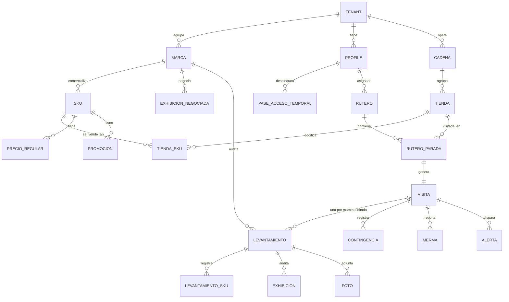

# 03 — Modelo de Datos

Volver a [[Market Track]] · Arquitectura: [[02 - Arquitectura Técnica]]

> Esquema relacional sobre **PostgreSQL** (Supabase). Todas las tablas de negocio llevan `tenant_id` para el aislamiento multi-tenant por cliente-marca. Las geometrías usan **PostGIS**.

## Diagrama entidad-relación (núcleo)



> **`tenant` es el CLIENTE, no la marca.** Un cliente puede comercializar varias
> marcas (Oster, Sharpie…), y el mercaderista —**exclusivo de un cliente**—
> audita en cada tienda todas las marcas de ese cliente que allí se vendan.
> Como cada marca vive en **un pasillo distinto**, una **visita** produce **un
> `levantamiento` por marca**: su foto "Antes", su Share of Shelf, sus
> exhibiciones y su foto "Después". Confirmado con el cliente en julio 2026.

---

## Entidades principales

### Organización y usuarios

**`tenant`** — **el cliente** que contrata a la outsourcing. Es la frontera de
aislamiento: todo dato lleva su `tenant_id`.
| Campo | Tipo | Nota |
|---|---|---|
| id | uuid PK | |
| nombre | text | el cliente, no la marca |
| activo | bool | |

**`marca`** — marca comercial de un cliente (Oster, Sharpie…). Un cliente puede
tener varias; el piloto (Maracumango) tiene **una sola**, pero el modelo no
puede asumirlo: añadirla después obligaría a re-escribir el `sku`, el
levantamiento y las políticas.
| Campo | Tipo | Nota |
|---|---|---|
| id | uuid PK | |
| tenant_id | uuid FK | a qué cliente pertenece |
| nombre | text | "Oster" |
| logo_url | text | el portal muestra el logo de la marca |
| tolerancia_precio_pct | numeric | **por marca**, no por cliente: cada marca tolera una desviación distinta |
| activo | bool | |

**`profile`** — usuario (extiende `auth.users`).
| Campo | Tipo | Nota |
|---|---|---|
| id | uuid PK (= auth.uid) | |
| rol | enum | `admin` \| `supervisor` \| `mercaderista` \| `cliente` |
| tenant_id | uuid FK | null para admin/supervisor de la outsourcing. **El mercaderista es exclusivo de un cliente** (confirmado jul 2026): un solo `tenant_id`, nunca varios |
| nombre, dni, telefono | text | `telefono` pasa a ser **obligatorio** si el usuario usa OTP por SMS/WhatsApp |
| telefono_verificado_at | timestamptz | un teléfono sin verificar no puede recibir el segundo factor |
| sctr_vigente_hasta | date | blindaje SUNAFIL |
| supervisor_id | uuid FK | a quién reporta el mercaderista |
| activo | bool | estado **individual** (contratado / desvinculado). Independiente del estado del cliente |
| desactivado_at | timestamptz | |

### Baja de un cliente: se cae su gente con él

Cuando un cliente cancela el servicio (`tenant.activo = false`), **todos los
mercaderistas de ese cliente pierden el acceso** — son exclusivos suyos y sin él
no tienen trabajo que hacer.

**El acceso efectivo es derivado, no se copia:**

```sql
profile.activo AND (profile.tenant_id IS NULL OR tenant.activo)
```

Un `admin` o `supervisor` de la outsourcing tiene `tenant_id` nulo: no cae con
ningún cliente.

**Por qué derivado y no un trigger que apague `profile.activo`.** Si al dar de
baja al cliente escribiéramos `false` en cada perfil, perderíamos el estado
individual: al reactivar al cliente meses después, volverían **todos** — incluido
el que fue desvinculado por robo durante la baja. Dos banderas independientes, y
el acceso exige las dos. Es la diferencia entre *"este cliente no opera"* y
*"esta persona no trabaja aquí"*.

**El punto que importa de verdad: la revocación tiene que llegar al teléfono.**
La app es offline-first — el mercaderista lleva encima una réplica SQLite con el
rutero, las tiendas y los SKUs del cliente. Apagar la fila en Postgres **no borra
lo que ya está en su bolsillo**. La baja debe:

1. **Cortar la sesión** (RLS y login rechazan al usuario deshabilitado).
2. **Vaciar los *buckets* de sync.** La *parameter query* de PowerSync debe
   exigir el acceso efectivo: si deja de cumplirse, los buckets desaparecen y el
   motor **purga la réplica local** en la siguiente conexión. Si la sync rule
   solo mira `tenant_id` sin comprobar el estado, el teléfono **seguirá
   descargando datos de un cliente que ya no es cliente.**
3. **Asumir el límite honesto:** un teléfono que nunca vuelve a conectarse
   conserva lo que ya tenía. Mitigación: vida corta del token de sesión y borrado
   local al fallar la autenticación. No hay forma de borrar remotamente un
   dispositivo que no habla con nosotros; documentarlo es mejor que fingir que sí.

Toda baja y toda reactivación quedan **auditadas** (quién, cuándo, por qué).

### Autenticación y acceso de emergencia

Añadido tras la revisión con el cliente (jul 2026): el segundo factor deja de
ser solo correo y aparece un mecanismo para desatascar al mercaderista que no
recibe su código.

**`configuracion_plataforma`** — ajustes globales de la operación de la
outsourcing (fila única). No lleva `tenant_id` porque el 2FA es una política de
**la outsourcing**, no de sus clientes: los admins y supervisores no pertenecen
a ningún cliente, y un mismo interruptor de seguridad no puede depender de a qué
cliente sirve cada usuario.
| Campo | Tipo | Nota |
|---|---|---|
| id | bool PK | singleton (`CHECK (id)`) |
| otp_requerido | bool | default `true` — el interruptor global de 2FA |
| otp_canales_habilitados | text[] | subconjunto de `{correo, sms, whatsapp}`; default `{correo}` (el correo es lo que fija la propuesta aceptada) |

**`pase_acceso_temporal`** — desbloqueo puntual de un usuario que no recibe su
OTP por ningún canal. Reemplaza a la idea de "desactivarle el 2FA a ese
usuario": un interruptor por usuario tiende a quedarse encendido para siempre y
se convierte en una puerta abierta permanente.
| Campo | Tipo | Nota |
|---|---|---|
| id | uuid PK | |
| profile_id | uuid FK | a quién se le concede |
| codigo_hash | text | **hash**, nunca el código en claro |
| motivo | text | obligatorio — queda en la auditoría |
| generado_por | uuid FK | admin o supervisor que lo emitió |
| generado_at | timestamptz | |
| expira_at | timestamptz | default `now() + 15 min` |
| usado_at | timestamptz | null hasta el canje; **un solo uso** |
| revocado_at | timestamptz | anulación manual |

RLS: el admin emite pases para cualquiera; el supervisor, **solo para los
mercaderistas que le reportan** (`profile.supervisor_id = auth.uid()`). Nadie
lee `codigo_hash`. Cada emisión y cada canje se registran como eventos de
auditoría, y una sesión iniciada con pase queda marcada como tal.

### Maestro comercial (pre-carga)

**`cadena`** — retail (Plaza Vea, Tottus…). `id, tenant_id, nombre, tipo_tienda`.

**`tienda`** — punto de venta físico.
| Campo | Tipo | Nota |
|---|---|---|
| id | uuid PK | |
| cadena_id, tenant_id | uuid FK | |
| nombre | text | "Plaza Vea Higuereta" |
| direccion | text | |
| ubicacion | geography(Point) | **PostGIS** — centro de geocerca |
| radio_geocerca_m | int | **default 100** (revisión con el cliente, jul 2026); editable por tienda |
| cluster | text | para promociones por cluster |

**`sku`** — producto. Cuelga de una **marca**, no del cliente: `id, marca_id, tenant_id, codigo, nombre, presentacion, ean/codigo_barras, activo`.

> `tenant_id` se denormaliza aquí (es derivable vía `marca`) porque **toda tabla
> de negocio lo necesita para su política RLS y para las *sync rules***. Un join
> a `marca` en cada política es caro y frágil; las sync rules, además, solo
> admiten un subconjunto de SQL sin joins complejos (ver
> [ADR-0001](adr/0001-motor-offline-dedicado.md)). Un trigger garantiza que
> `sku.tenant_id = marca.tenant_id`.

**`tienda_sku`** — qué SKUs están **codificados** en cada tienda (la "lista exacta" por tienda que pide el documento). `tienda_id, sku_id, activo`.

> **De aquí sale qué marcas se auditan en cada tienda**, sin tabla extra: son las
> marcas distintas de los SKUs codificados allí. Una `tienda_marca` sería un
> segundo dueño del mismo hecho, y divergiría.

**`precio_regular`** — precio regular por SKU / cadena / tipo de tienda. `sku_id, cadena_id, tipo_tienda, precio, vigente_desde`.

**`promocion`** — promo pre-cargada. `sku_id, precio_promo, fecha_inicio, fecha_fin, clusters[], comunicada(bool)`.

**`exhibicion_negociada`** — cabecera, isla, ruma negociada. `tienda_id, marca_id, tenant_id, sku_ids[], tipo, cantidad_sugerida, fecha_inicio, fecha_fin`. La negocia **una marca**, no el cliente entero.

### Operación (ruteros y visitas)

**`rutero`** — plan del día de un mercaderista. `id, mercaderista_id, fecha, estado`.

**`rutero_parada`** — cada tienda del rutero, ordenada. `rutero_id, tienda_id, orden, estado`.

**`visita`** — ejecución real en una tienda (núcleo transaccional).
| Campo | Tipo | Nota |
|---|---|---|
| id | uuid PK | |
| rutero_parada_id, mercaderista_id, tienda_id, tenant_id | FK | |
| check_in_at | timestamptz | hora de servidor |
| check_in_geo | geography(Point) | validación geocerca |
| selfie_foto_id | uuid FK | foto de ingreso con watermark |
| check_out_at | timestamptz | |
| estado | enum | `en_curso`\|`completada`\|`bloqueada` |
| bitacora | text | comentarios libres del check-out |
| tiempo_traslado_min | int | modo tránsito |

### Levantamiento

**`levantamiento`** — **la auditoría de UNA marca dentro de una visita.** Es la
pieza que el modelo no tenía y que la realidad física impone: Oster está en
electrodomésticos y Sharpie en papelería, así que cada marca tiene su propia
góndola, su propia foto "Antes", su propio Share of Shelf y su propia foto
"Después". Una visita produce **un `levantamiento` por cada marca del cliente
que se venda en esa tienda** (derivado de `tienda_sku`).
| Campo | Tipo | Nota |
|---|---|---|
| id | uuid PK | |
| visita_id, marca_id, tenant_id | FK | |
| foto_antes_id, foto_despues_id | uuid FK | la góndola **de esa marca** |
| sos_frentes_propios | int | agregado de esa góndola |
| sos_frentes_competencia | jsonb | `[{competidor, frentes}]` |
| sos_foto_id | uuid FK | opcional |
| estado | enum | `pendiente`\|`en_curso`\|`completado`\|`omitido` |

> El % de share es **derivado** (vista), y la suma del detalle por SKU permite
> cuadrar contra el agregado.
>
> **En el piloto hay una sola marca**, así que cada visita tendrá exactamente un
> `levantamiento` y la app se ve igual que si esta tabla no existiera. Esa es
> justamente la razón de crearla ahora: cuesta nada hoy y sería una reescritura
> del núcleo transaccional el día que entre el segundo cliente con tres marcas.

**`levantamiento_sku`** — datos por SKU dentro del levantamiento de su marca.
| Campo | Tipo | Nota |
|---|---|---|
| levantamiento_id, sku_id | FK | el SKU pertenece a la marca del levantamiento |
| frentes_propios | int | Share of Shelf **por SKU** (manual en MVP) |
| frentes_competencia | jsonb | `[{competidor, frentes}]` — *competidor* es texto libre (Frutísima, Selva Viva): **no** es la entidad `marca`, que solo modela las marcas de nuestros clientes |
| sos_foto_id | uuid FK | foto **opcional** del frente de ese SKU |
| stock_sistema | int | unidades en sistema |
| stock_piso | int | góndola + exhibiciones + trastienda |
| quiebre | bool | derivado — `stock_piso = 0 AND stock_sistema > 0` |
| diferencia | bool | derivado — `stock_piso > 0 AND stock_piso <> stock_sistema` |
| precio_registrado | numeric | precio digitado hoy |
| hay_promo, promo_comunicada | bool | flujo de preguntas del documento |

> **Quiebre y diferencia son excluyentes por construcción:** el quiebre exige
> piso = 0 y la diferencia exige piso > 0, así que un SKU nunca lleva los dos
> flags. Ambos se calculan en la misma vista/trigger — nunca en las apps.

**`exhibicion`** — auditoría de exhibición, dentro del levantamiento de su marca. `levantamiento_id, exhibicion_negociada_id (o tipo_adicional), instalada(bool), unidades, completa(bool), foto_id, vigente(bool)`.

**`contingencia`** — bypass de un paso (compromiso de la propuesta aceptada): cuando el mercaderista no puede completar una fase por causa externa, registra el hallazgo y continúa; dispara una alerta en tiempo real al supervisor.
| Campo | Tipo | Nota |
|---|---|---|
| visita_id, tenant_id | FK | |
| levantamiento_id | uuid FK | **null** si el paso omitido es de la visita (`checkin`/`checkout`); poblado si es de una marca concreta |
| paso | enum | `foto_antes`\|`share_of_shelf`\|`quiebres`\|`precios`\|`exhibiciones`\|`foto_despues`\|`checkin`\|`checkout` |
| motivo | text | causa externa (sin acceso al almacén, información no disponible…) |
| foto_id | uuid FK | evidencia opcional del hallazgo |
| registrada_at | timestamptz | hora local de captura (sincroniza offline) |

**`merma`** — producto dañado.
| Campo | Tipo | Nota |
|---|---|---|
| visita_id, sku_id | FK | |
| tipo | enum | `manipulacion`\|`transporte`\|`vencimiento` |
| foto_id | uuid FK | código de barras + daño |
| recibido_por | text | nombre del encargado (cargo digital) |

**`lote_vencimiento`** — control PVPS/FEFO. `visita_id, sku_id, lote, fecha_vencimiento, dias_para_vencer (derivado), alerta_color (verde/ámbar/rojo)`.

### Evidencia y alertas

**`foto`** — toda imagen. `id, visita_id, levantamiento_id (null en la selfie de check-in y en las contingencias de visita), tenant_id, tipo, url_r2, hash, capturada_at, geo, subida_at`.

| `tipo` | |
|---|---|
| `selfie` | ingreso; cuelga de la visita, no de una marca |
| `antes` · `despues` | la góndola **de una marca** |
| `sos` | frentes de un SKU |
| `exhibicion` · `precio` | evidencia del levantamiento |
| `contingencia` | evidencia del hallazgo al omitir un paso |
| `merma` | ⚪ fuera del piloto |

> El valor `contingencia` **faltaba**: la contingencia con foto es ✅ MVP y tiene
> su `foto_id`, pero sin este valor la imagen se colaría como `antes` y
> contaminaría la galería filtrable del portal.

**`alerta`** — disparada por las Edge Functions.
| Campo | Tipo | Nota |
|---|---|---|
| id, tenant_id, visita_id | FK | |
| marca_id | uuid FK | de qué marca es la alerta — el portal filtra por ella |
| tipo | enum | `quiebre`\|`diferencia_stock`\|`desviacion_precio`\|`promo_no_activa`\|`vencimiento`\|`exhibicion_incompleta`\|`hora_extra`\|`contingencia` |
| severidad | enum | `info`\|`alta`\|`critica` |
| canal | enum | `dashboard`\|`email`\|`whatsapp` |
| estado | enum | `nueva`\|`vista`\|`resuelta` |
| payload | jsonb | detalle |

### Comunicación y laboral (fases posteriores)

- **`comunicado`** — mensajes a equipo, `confirmacion_lectura` por usuario.
- **`capacitacion`** — material formativo móvil.
- **`jornada`** — derivada de check-in/out para el corte automático 8h/48h y la **aprobación de horas extra** (candado SUNAFIL).

---

## Cómo el modelo soporta los flujos del documento

| Requisito del documento | Tablas que lo resuelven |
|---|---|
| **Un cliente, varias marcas** (Oster, Sharpie…) | `tenant` (cliente) → `marca` → `sku` |
| **El mercaderista es exclusivo de un cliente** | `profile.tenant_id` único (nunca varios) |
| **Audita todas las marcas del cliente que se vendan en esa tienda** | un `levantamiento` por marca, derivadas de `tienda_sku` |
| **Si el cliente cancela, sus mercaderistas pierden el acceso** | `tenant.activo` + `profile.activo` (acceso = las dos) + sync rules que lo exigen |
| Lista exacta de SKUs por tienda | `tienda_sku` |
| Quiebre = sistema vs piso, cruce con OC | `levantamiento_sku` (stock_sistema, stock_piso) + Edge Function |
| **Diferencia de stock** (piso > 0 pero ≠ sistema) | `levantamiento_sku.diferencia` (derivado) + `alerta` tipo `diferencia_stock` |
| **SOS agregado + detalle por SKU, con foto** | `visita.sos_*` + `levantamiento_sku.frentes_*` + `foto` tipo `sos` |
| **2FA multicanal (correo/SMS/WhatsApp), activable** | `configuracion_plataforma.otp_canales_habilitados` |
| **Mercaderista que no recibe su OTP** | `pase_acceso_temporal` (un solo uso, 15 min, auditado) |
| Alertas de desviación de precio | `precio_regular`, `promocion`, `tenant.tolerancia_precio_pct`, `alerta` |
| Promos por cluster y "comunicada" | `promocion.clusters`, `promo_comunicada` |
| Exhibiciones negociadas y adicionales | `exhibicion_negociada`, `exhibicion` |
| Exhibición "vive" en mercaderista y tienda | FK a ambos en `exhibicion`/`visita` (para incentivos y cambios de ruta) |
| Semáforo de vencimientos | `lote_vencimiento` + job `pg_cron` |
| Cargo digital de merma | `merma.recibido_por` + `foto` |
| Geocerca anti-fake-GPS | `tienda.ubicacion` (PostGIS) + `visita.check_in_geo` |
| Mecanismo de contingencia (bypass) con alerta al supervisor | `contingencia` + `alerta` (tipo `contingencia`, canal dashboard en tiempo real) |
| Corte de jornada / horas extra | `jornada` derivada de `visita` |

---

## Entidades añadidas tras el benchmark LiveTrade

Ver [[07 - Benchmark LiveTrade (Overall)]]. La plataforma de Overall revela conceptos que conviene incorporar:

**`campania`** — agrupador de operación/reportes por cliente-marca (LiveTrade organiza todo por "Campaña", ej. *KPI Comercial*, *KPI Trade*). `id, tenant_id, nombre, tipo, fecha_inicio, fecha_fin, activa`. Las `visita`, `rutero` y `actividad` referencian `campania_id`.

**`actividad`** — actividad en PDV, **propia o de la competencia** (módulo diferenciador y barato de capturar en el MVP).
| Campo | Tipo | Nota |
|---|---|---|
| visita_id, tenant_id, campania_id | FK | |
| origen | enum | `propia` \| `competencia` |
| marca | text | marca observada (propia o rival) |
| categoria, familia | text | |
| tipo | enum | `activacion` \| `demostracion` \| `dinamica` \| … |
| cadena_id, provincia | FK/text | |
| fecha | date | |
| foto_id | uuid FK | evidencia |

**Enriquecer `visita`** con campos vistos en el módulo **Tracking** de LiveTrade:
`foto_inicio_id`, `foto_salida_id`, `duracion_min` (derivado), `tiempo_traslado_min`, `visita_efectiva` (bool), `bateria_inicio` (int %), `posicion_fin` (geography(Point)), `motivo` (text — p. ej. no-visita justificada), `pais`, `perfil`.

> El **Tracking** de LiveTrade = nuestra tabla `visita` + `foto`. Sus columnas exactas (Usuario, Nro Documento, PDV, Fecha Inicio/Fin, Foto Inicio/Salida, Duración, Traslado, Visita Efectiva, Batería, Posición Fin, Motivo, Campaña, Actividad, País, Perfil) son la mejor guía de campos para el MVP.

> **Fuera del MVP** (capa de inteligencia comercial de LiveTrade): `sell_out`, `market_share`, `clustering`, `web_scraping_precio`, `status_sap`, `cuota`, `msl`. Requieren integrar ERP/SAP del cliente, paneles de mercado y scraping de ecommerce → **Fase futura**, no entran al piloto. Ver la distinción capa A/B en [[07 - Benchmark LiveTrade (Overall)]].

---

## Notas de implementación

- **RLS** en todas las tablas con `tenant_id`; políticas por rol.
- **Índices** geoespaciales (GiST) en `tienda.ubicacion`; índices por `(tenant_id, fecha)` en `visita` para los dashboards.
- **Tipos generados** automáticamente desde el esquema (Supabase → TypeScript) y compartidos en `packages/shared`.
- Campos *derivados* (quiebre, días para vencer, color de semáforo) calculados en **vistas** o por trigger/Edge Function, no duplicados a mano.

---

⬅ [[02 - Arquitectura Técnica]] · Siguiente: [[04 - Módulos y Funcionalidades]]
