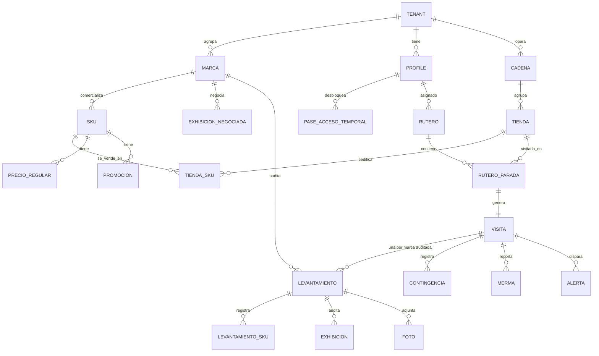

# 03 — Modelo de Datos

Volver a [[Market Track]] · Arquitectura: [[02 - Arquitectura Técnica]]

> Esquema relacional sobre **PostgreSQL** (Supabase). Todas las tablas de negocio llevan `tenant_id` para el aislamiento multi-tenant por cliente-marca. Las geometrías usan **PostGIS**.

## Diagrama entidad-relación (núcleo)



> **`tenant` es el CLIENTE, no la marca.** Un cliente puede comercializar varias
> marcas (Oster, Sharpie…), y el mercaderista —**exclusivo de un cliente**—
> audita en cada tienda todas las marcas de ese cliente que allí se vendan.
> Como cada marca vive en **un pasillo distinto**, una **visita** produce **un
> `levantamiento` por marca**: su foto "Antes", su Share of Shelf, sus
> exhibiciones y su foto "Después". Confirmado con el cliente en julio 2026.

---

## Entidades principales

### Organización y usuarios

**`tenant`** — **el cliente** que contrata a la outsourcing. Es la frontera de
aislamiento: todo dato lleva su `tenant_id`.
| Campo | Tipo | Nota |
|---|---|---|
| id | uuid PK | |
| nombre | text | el cliente, no la marca |
| activo | bool | |

**`marca`** — marca comercial de un cliente (Oster, Sharpie…). Un cliente puede
tener varias; el piloto (Maracumango) tiene **una sola**, pero el modelo no
puede asumirlo: añadirla después obligaría a re-escribir el `sku`, el
levantamiento y las políticas.
| Campo | Tipo | Nota |
|---|---|---|
| id | uuid PK | |
| tenant_id | uuid FK | a qué cliente pertenece |
| nombre | text | "Oster" |
| logo_url | text | el portal muestra el logo de la marca |
| tolerancia_precio_pct | numeric | **por marca**, no por cliente: cada marca tolera una desviación distinta |
| activo | bool | |

**`profile`** — usuario (extiende `auth.users`).
| Campo | Tipo | Nota |
|---|---|---|
| id | uuid PK (= auth.uid) | |
| rol | enum | `admin` \| `supervisor` \| `mercaderista` \| `cliente` |
| tenant_id | uuid FK | null para admin/supervisor de la outsourcing. **El mercaderista es exclusivo de un cliente** (confirmado jul 2026): un solo `tenant_id`, nunca varios |
| nombre, dni, telefono | text | `telefono` pasa a ser **obligatorio** si el usuario usa OTP por SMS/WhatsApp |
| telefono_verificado_at | timestamptz | un teléfono sin verificar no puede recibir el segundo factor |
| sctr_vigente_hasta | date | blindaje SUNAFIL |
| supervisor_id | uuid FK | a quién reporta el mercaderista |
| activo | bool | estado **individual** (contratado / desvinculado). Independiente del estado del cliente |
| desactivado_at | timestamptz | |

### Baja de un cliente: se cae su gente con él

Cuando un cliente cancela el servicio (`tenant.activo = false`), **todos los
mercaderistas de ese cliente pierden el acceso** — son exclusivos suyos y sin él
no tienen trabajo que hacer.

**El acceso efectivo es derivado, no se copia:**

```sql
profile.activo AND (profile.tenant_id IS NULL OR tenant.activo)
```

Un `admin` o `supervisor` de la outsourcing tiene `tenant_id` nulo: no cae con
ningún cliente.

**Por qué derivado y no un trigger que apague `profile.activo`.** Si al dar de
baja al cliente escribiéramos `false` en cada perfil, perderíamos el estado
individual: al reactivar al cliente meses después, volverían **todos** — incluido
el que fue desvinculado por robo durante la baja. Dos banderas independientes, y
el acceso exige las dos. Es la diferencia entre *"este cliente no opera"* y
*"esta persona no trabaja aquí"*.

**El punto que importa de verdad: la revocación tiene que llegar al teléfono.**
La app es offline-first — el mercaderista lleva encima una réplica SQLite con el
rutero, las tiendas y los SKUs del cliente. Apagar la fila en Postgres **no borra
lo que ya está en su bolsillo**. La baja debe:

1. **Dejarlo sin datos** (RLS). ⚠️ **La RLS NO bloquea el login** — verificado: el
   usuario desactivado **sí recibe un token válido**, simplemente no ve nada.
   GoTrue solo mira `auth.users`, no `public.profile`. Rechazar la
   autenticación de verdad exige `auth.users.banned_until` o un hook
   `custom_access_token`: **no está implementado todavía**.
2. **Vaciar los *buckets* de sync.** La *parameter query* de PowerSync debe
   exigir el acceso efectivo: si deja de cumplirse, los buckets desaparecen y el
   motor **purga la réplica local** en la siguiente conexión. Si la sync rule
   solo mira `tenant_id` sin comprobar el estado, el teléfono **seguirá
   descargando datos de un cliente que ya no es cliente.**
3. **Asumir el límite honesto:** un teléfono que nunca vuelve a conectarse
   conserva lo que ya tenía. Mitigación: vida corta del token de sesión y borrado
   local al fallar la autenticación. No hay forma de borrar remotamente un
   dispositivo que no habla con nosotros; documentarlo es mejor que fingir que sí.

Toda baja y toda reactivación quedan **auditadas** (quién, cuándo, por qué).

### Autenticación y acceso de emergencia

Añadido tras la revisión con el cliente (jul 2026): el segundo factor deja de
ser solo correo y aparece un mecanismo para desatascar al mercaderista que no
recibe su código.

**`configuracion_plataforma`** — ajustes globales de la operación de la
outsourcing (fila única). No lleva `tenant_id` porque el 2FA es una política de
**la outsourcing**, no de sus clientes: los admins y supervisores no pertenecen
a ningún cliente, y un mismo interruptor de seguridad no puede depender de a qué
cliente sirve cada usuario.
| Campo | Tipo | Nota |
|---|---|---|
| id | bool PK | singleton (`CHECK (id)`) |
| otp_requerido | bool | default `true` — el interruptor global de 2FA |
| otp_canales_habilitados | text[] | subconjunto de `{correo, sms, whatsapp}`; default `{correo}` (el correo es lo que fija la propuesta aceptada) |

**`pase_acceso_temporal`** — desbloqueo puntual de un usuario que no recibe su
OTP por ningún canal. Reemplaza a la idea de "desactivarle el 2FA a ese
usuario": un interruptor por usuario tiende a quedarse encendido para siempre y
se convierte en una puerta abierta permanente.
| Campo | Tipo | Nota |
|---|---|---|
| id | uuid PK | |
| profile_id | uuid FK | a quién se le concede |
| codigo_hash | text | **hash**, nunca el código en claro |
| motivo | text | obligatorio — queda en la auditoría |
| generado_por | uuid FK | admin o supervisor que lo emitió |
| generado_at | timestamptz | |
| expira_at | timestamptz | default `now() + 15 min` |
| usado_at | timestamptz | null hasta el canje; **un solo uso** |
| revocado_at | timestamptz | anulación manual |

RLS: el admin emite pases para cualquiera; el supervisor, **solo para los
mercaderistas que le reportan** (`profile.supervisor_id = auth.uid()`). Nadie
lee `codigo_hash`. Cada emisión y cada canje se registran como eventos de
auditoría, y una sesión iniciada con pase queda marcada como tal.

### Maestro comercial (pre-carga)

> **La pre-carga llega como un Excel del cliente**, no tecleada a mano. Eso
> impone dos cosas al esquema:
>
> **`codigo_externo`** en `marca`, `cadena`, `tienda` y `sku` — el código que usa
> **el cliente** en su Excel. Es la **clave natural del upsert**: sin ella, la
> segunda importación duplicaría todo el catálogo. `UNIQUE (tenant_id,
> codigo_externo)`.
>
> **`activo`** explícito en esas mismas tablas. **La importación solo añade y
> actualiza: nunca desactiva por ausencia.** Que un SKU desaparezca del Excel
> nuevo no significa que lo hayan dado de baja — puede que copiaran mal una hoja
> o dejaran un filtro puesto. Para dar de baja, el cliente pone `activo = NO` en
> su archivo. Un despiste suyo no puede apagarle el catálogo y dejar a treinta
> mercaderistas en campo con la lista de SKUs equivocada. (Es la regla de
> "reconciliación destructiva" de `coding_practices.md`: distinguir *confirmado
> como ausente* de *no llegó la información*.)

**`cadena`** — retail (Plaza Vea, Tottus…). `id, tenant_id, nombre, tipo_tienda`.

**`tienda`** — punto de venta físico.
| Campo | Tipo | Nota |
|---|---|---|
| id | uuid PK | |
| cadena_id, tenant_id | uuid FK | |
| nombre | text | "Plaza Vea Higuereta" |
| direccion | text | |
| departamento | text | ubicación administrativa (Perú) — 2ª revisión jul 2026 |
| provincia | text | "ciudad" en el pedido del cliente; **provincia** en la jerarquía peruana |
| distrito | text | 2ª revisión jul 2026 |
| ubicacion | geography(Point) | **PostGIS** — centro de geocerca |
| radio_geocerca_m | int | **default 100** (revisión con el cliente, jul 2026); editable por tienda |
| cluster | text | nivel del PDV (AAA/AA/A/B…); usado para promos por cluster. Los **valores son configurables por cliente** (catálogo `cluster_tienda`, 2ª revisión jul 2026) |

**`sku`** — producto. Cuelga de una **marca**, no del cliente: `id, marca_id, tenant_id, codigo, nombre, presentacion, ean/codigo_barras, activo`.

> `tenant_id` se denormaliza aquí (es derivable vía `marca`) porque **toda tabla
> de negocio lo necesita para su política RLS y para las *sync rules***. Un join
> a `marca` en cada política es caro y frágil; las sync rules, además, solo
> admiten un subconjunto de SQL sin joins complejos (ver
> [ADR-0001](adr/0001-motor-offline-dedicado.md)). Un trigger garantiza que
> `sku.tenant_id = marca.tenant_id`.

**`tienda_sku`** — qué SKUs están **codificados** en cada tienda (la "lista exacta" por tienda que pide el documento). `tienda_id, sku_id, activo`.

> **De aquí sale qué marcas se auditan en cada tienda**, sin tabla extra: son las
> marcas distintas de los SKUs codificados allí. Una `tienda_marca` sería un
> segundo dueño del mismo hecho, y divergiría.

**`precio_regular`** — precio regular por SKU / cadena / tipo de tienda. `sku_id, cadena_id, tipo_tienda, precio, vigente_desde`.

**`promocion`** — promo pre-cargada. `sku_id, precio_promo, fecha_inicio, fecha_fin, clusters[], comunicada(bool)`.

**`exhibicion_negociada`** — cabecera, isla, ruma negociada. `tienda_id, marca_id, tenant_id, sku_ids[], tipo, cantidad_sugerida, fecha_inicio, fecha_fin`. La negocia **una marca**, no el cliente entero.

### Operación (ruteros y visitas)

**`rutero`** — plan del día de un mercaderista. `id, mercaderista_id, fecha, estado`.

**`rutero_parada`** — cada tienda del rutero, ordenada. `rutero_id, tienda_id, orden, estado`.

**`rutero_parada_retirada`** — quién quitó qué parada, de qué rutero y con el
rutero en qué estado. **Sin FK a `rutero`** a propósito: `rutero_parada` cuelga
de `rutero` con `on delete cascade`, así que una FK aquí se llevaría el rastro
justo cuando se borra lo que audita. El contexto (`fecha`, `mercaderista_id`,
`orden`, `hora_planificada`, `estado_rutero`) va desnormalizado por lo mismo: es
el estado en el INSTANTE del retiro. Solo la escribe `quitar_parada_rutero`; el
grant a `authenticated` es de `select` y nada más, así que una fila de auditoría
no se puede forjar ni borrar con un JWT.

**Corregir un rutero ya publicado** — `public.quitar_parada_rutero` abre una
ventana estrecha sobre el trigger `parada_solo_se_planifica_en_borrador`: quitar
una parada y reordenar las que quedan se permite en `borrador` **y en
`publicado`**; añadir una tienda, no, y cambiarle la tienda a una parada
existente tampoco (sería sustituir el destino sin dejar rastro). Por encima hay
dos guardarraíles que el estado no da:

* **la visita** — `visita_parada_fk ... on delete restrict` es una verja dura por
  debajo del trigger. La RPC la comprueba antes para poder dar un mensaje que se
  entienda, con el MISMO SQLSTATE que levantaría la FK: si entre la comprobación
  y el borrado entra un check-in, una sola rama cubre las dos. Ojo: esa FK corta
  también la CASCADA del rutero entero, así que «borrar el día y rehacerlo» deja
  de funcionar en cuanto alguien ficha.
* **el día pasado** — `rutero.estado` **no sale nunca de `publicado`** (nada en el
  repo lo avanza a `en_curso` ni a `completado`), así que «solo en publicado»
  incluye el rutero de hace tres meses. Y `puntualidad_paradas` cuenta las paradas
  de todo rutero distinto de borrador: quitar una de un día pasado borra un
  `falto` y sube el bono del periodo abierto. `cerrado_at` protege los periodos ya
  sellados, no el mes en curso.

La **hora** sigue siendo solo de borrador, y no por descuido:
`fijar_hora_parada` la rechaza fuera de ahí porque es la vara con la que se mide
la puntualidad, y moverla después de ver a qué hora fichó el mercaderista no es
planificar sino fabricar el resultado. El panel la muestra con su motivo en vez
de esconder el campo.

**`visita`** — ejecución real en una tienda (núcleo transaccional).
| Campo | Tipo | Nota |
|---|---|---|
| id | uuid PK | |
| rutero_parada_id, mercaderista_id, tienda_id, tenant_id | FK | |
| check_in_at | timestamptz | hora que **declara el teléfono** (se puede cambiar a mano) |
| check_in_recibido_at | timestamptz | hora de servidor, autoritativa: la sella el trigger |
| check_in_geo | geography(Point) | validación geocerca |
| selfie_foto_id | uuid FK | foto de ingreso con watermark |
| check_out_at | timestamptz | |
| estado | enum | `en_curso`\|`completada`\|`bloqueada` |
| bitacora | text | comentarios libres del check-out |
| tiempo_traslado_min | int | modo tránsito |

### Levantamiento

**`levantamiento`** — **la auditoría de UNA marca dentro de una visita.** Es la
pieza que el modelo no tenía y que la realidad física impone: Oster está en
electrodomésticos y Sharpie en papelería, así que cada marca tiene su propia
góndola, su propia foto "Antes", su propio Share of Shelf y su propia foto
"Después". Una visita produce **un `levantamiento` por cada marca del cliente
que se venda en esa tienda** (derivado de `tienda_sku`).
| Campo | Tipo | Nota |
|---|---|---|
| id | uuid PK | |
| visita_id, marca_id, tenant_id | FK | |
| foto_antes_id, foto_despues_id | uuid FK | la góndola **de esa marca** |
| sos_frentes_propios | int | agregado de esa góndola |
| sos_frentes_competencia | jsonb | `[{competidor, frentes}]` |
| sos_foto_id | uuid FK | opcional |
| estado | enum | `pendiente`\|`en_curso`\|`completado`\|`omitido` |

> El % de share es **derivado** (vista), y la suma del detalle por SKU permite
> cuadrar contra el agregado.
>
> **En el piloto hay una sola marca**, así que cada visita tendrá exactamente un
> `levantamiento` y la app se ve igual que si esta tabla no existiera. Esa es
> justamente la razón de crearla ahora: cuesta nada hoy y sería una reescritura
> del núcleo transaccional el día que entre el segundo cliente con tres marcas.

**`levantamiento_sku`** — datos por SKU dentro del levantamiento de su marca.
| Campo | Tipo | Nota |
|---|---|---|
| levantamiento_id, sku_id | FK | el SKU pertenece a la marca del levantamiento |
| frentes_propios | int | Share of Shelf **por SKU** (manual en MVP) |
| frentes_competencia | jsonb | `[{competidor, frentes}]` — *competidor* es texto libre (Frutísima, Selva Viva): **no** es la entidad `marca`, que solo modela las marcas de nuestros clientes |
| sos_foto_id | uuid FK | foto **opcional** del frente de ese SKU |
| stock_sistema | int | unidades en sistema |
| stock_piso | int | góndola + exhibiciones + trastienda |
| quiebre | bool | derivado — `stock_piso = 0 AND stock_sistema > 0` |
| diferencia | bool | derivado — `stock_piso > 0 AND stock_piso <> stock_sistema` |
| precio_registrado | numeric | precio digitado hoy |
| hay_promo, promo_comunicada | bool | flujo de preguntas del documento |

> **Quiebre y diferencia son excluyentes por construcción:** el quiebre exige
> piso = 0 y la diferencia exige piso > 0, así que un SKU nunca lleva los dos
> flags. Ambos se calculan en la misma vista/trigger — nunca en las apps.

**`exhibicion`** — auditoría de exhibición, dentro del levantamiento de su marca. `levantamiento_id, exhibicion_negociada_id (o tipo_adicional), instalada(bool), unidades, completa(bool), foto_id, vigente(bool)`.

**`contingencia`** — bypass de un paso (compromiso de la propuesta aceptada): cuando el mercaderista no puede completar una fase por causa externa, registra el hallazgo y continúa; dispara una alerta en tiempo real al supervisor.
| Campo | Tipo | Nota |
|---|---|---|
| visita_id, tenant_id | FK | |
| levantamiento_id | uuid FK | **null** si el paso omitido es de la visita (`checkin`/`checkout`); poblado si es de una marca concreta |
| paso | enum | `foto_antes`\|`share_of_shelf`\|`quiebres`\|`precios`\|`exhibiciones`\|`foto_despues`\|`checkin`\|`checkout` |
| motivo | text | causa externa (sin acceso al almacén, información no disponible…) |
| foto_id | uuid FK | evidencia opcional del hallazgo |
| registrada_at | timestamptz | hora local de captura (sincroniza offline) |

**`merma`** — producto dañado.
| Campo | Tipo | Nota |
|---|---|---|
| visita_id, sku_id | FK | |
| tipo | enum | `manipulacion`\|`transporte`\|`vencimiento` |
| foto_id | uuid FK | código de barras + daño |
| recibido_por | text | nombre del encargado (cargo digital) |

**`lote_vencimiento`** — control PVPS/FEFO. `visita_id, sku_id, lote, fecha_vencimiento, dias_para_vencer (derivado), alerta_color (verde/ámbar/rojo)`.

### Importación del Excel del cliente

El cliente manda su maestro (marcas, tiendas, SKUs, matriz tienda×SKU, precios,
promos) en un Excel. **Sin una pre-carga correcta la app del mercaderista no
sirve** (ver [ADR-0007](adr/0007-catalogos-y-tolerancias-precargados.md)): una
matriz mal cargada hace que el mercaderista vea en su teléfono productos que esa
tienda no vende, y el dato de toda la jornada sale inservible.

**`importacion`** — cada intento de carga, con su resultado. Es la evidencia de
*qué nos mandaron y qué hicimos con ello*.
| Campo | Tipo | Nota |
|---|---|---|
| id | uuid PK | |
| tenant_id | uuid FK | a qué cliente pertenece el maestro |
| archivo_url_r2, archivo_hash | text | **el .xlsx original se conserva**: es la prueba de qué se recibió |
| subido_por | uuid FK | |
| estado | enum | `validando` \| `con_errores` \| `previsualizada` \| `aplicada` \| `cancelada` |
| resumen | jsonb | `{creadas, actualizadas, con_error}` por entidad |
| errores | jsonb | `[{hoja, fila, columna, valor, mensaje}]` — el informe fila por fila |
| aplicada_at | timestamptz | null hasta que el admin confirma |

**`mapeo_importacion`** — cómo se traducen las columnas del Excel *de ese
cliente* a nuestros campos, guardado para no repetir el trabajo en cada carga.
`id, tenant_id, nombre, mapeo (jsonb: hoja → entidad, columna → campo), creado_por`.

**El flujo, y por qué es así:**

1. El admin sube el `.xlsx`. **Se parsea en el navegador** (son cientos de filas;
   no hace falta procesamiento en segundo plano).
2. Si es la **plantilla nuestra**, el mapeo es implícito. Si es **el Excel del
   cliente**, el admin mapea las columnas una vez y el mapeo queda guardado.
3. **Vista previa obligatoria**: cuántas filas se crearían, cuántas se
   actualizarían, y **cada error con su hoja, fila y motivo**. Nada se ha escrito
   todavía.
4. El admin confirma → una Edge Function **revalida en servidor** y aplica **en
   una transacción**: upsert por `(tenant_id, codigo_externo)`. Si algo falla, no
   se aplica nada — jamás un catálogo a medio cargar.

> **La validación del navegador es UX, no seguridad.** El servidor revalida
> siempre: el payload que llega a la Edge Function es entrada externa y se parsea
> con Zod, como cualquier otra frontera.

**`foto`** — toda imagen. `id, visita_id, levantamiento_id (null en la selfie de check-in y en las contingencias de visita), tenant_id, tipo, url_r2, hash, capturada_at, geo, subida_at, verificada_at, bytes_r2, verificacion_intento_at`.

> **`verificada_at` la escribe SOLO el servidor.** `hash` y `subida_at` los
> escribe el móvil; `verificada_at` la sella la Edge Function `fotos-verificar`
> (service_role) tras comprobar con un HEAD contra R2 que existe un objeto bajo
> la key de la foto. Prueba que hay bytes subidos, **no** el contenido de la
> imagen. Un trigger impide que la app la escriba o la cambie, y congela la
> identidad de la fila (`id, tenant, visita, levantamiento, tipo, hash,
> capturada_at`): un trigger y no un grant por columna, para que el upsert de
> fila entera con que PowerSync reintenta siga pasando. La sella un barrido de
> pg_cron cada 5 min (`app.barrer_fotos_sin_verificar`); 404 no sella, 5xx no
> sella y se reintenta — nunca se borra nada. `verificacion_intento_at` ordena
> la cola del barrido; `bytes_r2` es el tamaño que devolvió R2. **El motor del
> plan de lealtad acredita por esta columna**, nunca por `hash`.

| `tipo` | |
|---|---|
| `selfie` | ingreso; cuelga de la visita, no de una marca |
| `antes` · `despues` | la góndola **de una marca** |
| `sos` | frentes de un SKU |
| `exhibicion` · `precio` | evidencia del levantamiento |
| `contingencia` | evidencia del hallazgo al omitir un paso |
| `merma` | ⚪ fuera del piloto |

> El valor `contingencia` **faltaba**: la contingencia con foto es ✅ MVP y tiene
> su `foto_id`, pero sin este valor la imagen se colaría como `antes` y
> contaminaría la galería filtrable del portal.

> **Quién lee `foto`** (política por rol): el staff, todo; el cliente-marca, la
> evidencia de su operación menos la selfie y la foto de herramientas del
> check-in (datos del personal de la outsourcing); el mercaderista, **solo la de
> sus propias visitas** — igual que la sync acota la bajada a su teléfono, la
> política acota PostgREST. La misma acotación por dueño rige la lectura del
> mercaderista sobre `visita` y `visita_respuesta`. (`levantamiento_respuesta`
> sigue tenant-wide en ambas superficies: se acota junto con su stream.)

**`alerta`** — disparada por las Edge Functions.
| Campo | Tipo | Nota |
|---|---|---|
| id, tenant_id, visita_id | FK | |
| marca_id | uuid FK | de qué marca es la alerta — el portal filtra por ella |
| tipo | enum | `quiebre`\|`diferencia_stock`\|`desviacion_precio`\|`promo_no_activa`\|`exhibicion_incompleta`\|`contingencia`\|`verificacion_fotos` |

> **`verificacion_fotos` es de STAFF, no del cliente-marca.** La levanta el
> guardarraíl del plan de lealtad y habla del bono de un mercaderista. Quien
> impide que llegue al portal es la política `alerta_usuario_lee_su_tenant` (y,
> para el feed en vivo, `app.difundir_cambio_en_vivo`), a través del whitelist
> `app.tipo_alerta_del_cliente` — no la consulta que agrupe las alertas.
| severidad | enum | `info`\|`alta`\|`critica` |
| canal | enum | `dashboard`\|`email`\|`whatsapp` |
| estado | enum | `nueva`\|`vista`\|`resuelta` |
| payload | jsonb | detalle |

### Comunicación y laboral (fases posteriores)

- **`comunicado`** — mensajes a equipo, `confirmacion_lectura` por usuario.
- **`capacitacion`** — material formativo móvil.
- **`jornada`** — derivada de check-in/out para el corte automático 8h/48h y la **aprobación de horas extra** (candado SUNAFIL).

### Entidades añadidas tras la 2ª revisión con el cliente (jul 2026)

Cinco peticiones nuevas del cliente que entran al piloto (ver
[[04 - Módulos y Funcionalidades]], "Segunda revisión con el cliente"). El
diseño fino de cada tabla vive en su ticket de Linear; aquí queda el esbozo.

**`solicitud_cambio_ruta`** — el mercaderista pide un cambio en su rutero; el
supervisor lo ve y resuelve. `id, tenant_id, mercaderista_id, rutero_id (o
fecha), tipo (cambio_tienda|cambio_dia|no_visita|otro), motivo (obligatorio),
estado (nueva|vista|resuelta|rechazada), resuelta_por, resuelta_at,
comentario_resolucion, creada_at`. RLS: el mercaderista ve las suyas; el
supervisor, las de sus reportes. La sync rule replica al teléfono **solo las
propias** (`request.user_id()`).

**`cluster_tienda`** — catálogo de niveles de PDV **por cliente**, para que los
valores del `tienda.cluster` sean configurables. `id, tenant_id, codigo, nombre,
orden, activo`. Se siembran AAA/AA/A/B pero cada cliente los edita.

**`formulario_levantamiento` + `formulario_version`** — definición
**schema-driven** del wizard que ven los mercaderistas, editable por el admin y
**versionada** (publicar deja una versión inmutable). Los campos con lógica de
negocio (quiebre/diferencia, SOS por frentes, precio/promo) **siguen calculados
por la base**: el formulario configura presentación y campos libres, no reescribe
reglas. La app **renderiza la definición publicada** en vez de pasos codificados
— reformula el wizard fijo actual.

**`portal_modulo_habilitado`** — qué secciones del portal cliente ve cada
cliente. `tenant_id, modulo, habilitado`. Default: todas habilitadas. Solo el
admin escribe; el portal lo respeta server-side (una sección deshabilitada no se
muestra ni es accesible por URL).

### Entidades añadidas tras la 3ª revisión con el cliente (ago 2026)

Las dos métricas nuevas —**Perfect Store** y **Perfect Merchandiser**— no caben
en el modelo actual: falta el eje por el que se ponderan, falta contra qué
comparar la llegada del mercaderista, y falta dónde guardar un puntaje sin que se
reescriba solo cuando alguien cambie los pesos. Ver
[[04 - Módulos y Funcionalidades]], "Tercera revisión con el cliente". El diseño
fino de cada tabla vive en su ticket; aquí queda el esbozo.

**`categoria`** — el eje de ponderación que hoy **no existe**. `sku` cuelga de
`marca` y no hay ningún nivel intermedio, así que no se puede agrupar ni ponderar
un puntaje "por categoría". `id, tenant_id, nombre, codigo_externo, activo` +
`sku.categoria_id` **nullable**: la columna primero, la carga después, el consumo
al final. Es la pieza que bloquea toda la medición.

**Configuración de Perfect Store** — el peso y el objetivo de cada variable, por
`tenant × marca × categoria × tipo_tienda`. **`marca` es el piso**: siempre hay
una fila a ese nivel, y `categoria` y `tipo_tienda` la afinan. Al resolver, gana
la fila más específica que aplique y se cae al default de la marca. Guarda el peso de las cinco
variables, el objetivo de share of shelf y **su unidad** (`frentes` |
`centimetros`), la política de POP (`dentro_del_tope` | `bonus_sobre_100`) y
cuántos puntos vale cada nivel de la escala cualitativa.

> La **tolerancia de precio no se duplica aquí**: ya vive en
> `marca.tolerancia_precio_pct` y la usa el motor de alertas. Un segundo dueño
> divergiría, y el cliente vería dos verdades sobre el mismo SKU.

**`rutero_parada.hora_planificada`** — hora local de Lima esperada en cada
parada, más una tolerancia en minutos por tenant. Hoy `rutero_parada` ordena
(`orden`) y marca `estado`, pero no guarda ninguna hora esperada, así que **no se
puede afirmar que alguien llegó tarde**. De aquí salen `minutos_desvio` y
`asistio`, derivados **en la base**. Una parada sin hora planificada no puntúa
puntualidad — no penaliza.

> **Contra qué se mide la llegada: `check_in_recibido_at`, no `check_in_at`.**
> La segunda es la hora que **declara el teléfono** y se puede cambiar a mano; la
> autoritativa la sella el trigger de geocerca en el servidor. La puntualidad
> alimenta los bonos del Perfect Merchandiser: derivarla del reloj del
> dispositivo sería pagar por un dato que el propio interesado controla.

**Puntajes de Perfect Store** — el resultado por `levantamiento` (una marca en
una visita) con su desglose por variable, más los agregados por tienda, marca,
categoría, tipo de tienda y periodo. Dos invariantes:

- **Cada puntaje guarda con qué configuración se calculó.** Cambiar los pesos no
  reescribe la historia.
- **Una variable no evaluada renormaliza el peso, no puntúa cero.** Si el POP no
  aplica o un paso quedó en contingencia, su peso se reparte entre las evaluadas.
  Un cero silencioso convierte una visita incompleta en una tienda mal ejecutada.

**Puntajes de Perfect Merchandiser** — implementado (MAR-100). Tres tablas:

- **`config_perfect_merchandiser`** — los cinco pesos por cliente (sin ejes de
  marca ni tipo de tienda: ponderar por ahí volvería a medir al mercaderista por
  el tamaño de su tienda), más la **política** de puntualidad —tolerancia y
  minutos a los que la parada puntúa 0— y los días de gracia antes de congelar
  el periodo. Filas **inmutables**, versionadas por `vigente_desde`.
- **`nivel_bono_merchandiser`** — la escalera de bonos como **umbrales**
  (`puntaje_min`, sin máximo): "todos los que llegan a este nivel reciben tanto".
  Un rango con mínimo y máximo admitiría huecos y solapes silenciosos. Publicar
  una escalera nueva **reemplaza la anterior entera**, en una transacción.
- **`puntaje_merchandiser`** — clave `(mercaderista_id, tipo, periodo_inicio)`,
  con los cinco porcentajes, el total, diez contadores de cobertura que explican
  el número, el `config_id` que lo produjo y `cerrado_at`. Guarda además la
  **posición** del ranking (`posicion`, `mercaderistas_evaluados`, `hay_empate`)
  y una clave sustituta `id`: el móvil replica una sola fila y con una fila no se
  puede calcular un rango, así que la posición viaja calculada. El `id` no es
  cosmético — PowerSync identifica cada fila replicada por esa columna y la clave
  real es compuesta; sin ella, todos los periodos de una persona colapsarían en
  una sola fila local. La tabla lleva `replica identity using index` sobre ese
  `id` para que los borrados del motor lleguen mapeados.

Cinco invariantes:

- **El puntaje guarda con qué configuración se calculó.** Cambiar los pesos no
  reescribe la historia (ADR-0011).
- **Una variable no evaluada renormaliza su peso, no puntúa cero.** Un cero
  silencioso convertiría un periodo a medio medir en un mal desempeño.
- **Un periodo cerrado no se recalcula.** Se sella solo, en el propio cálculo,
  pasada la ventana de gracia — que existe porque el móvil es offline-first y un
  teléfono sin señal sincroniza después de que el mes terminó. No hay reapertura.
- **La política es del motor; el hecho, de `puntualidad_paradas`.** El motor usa
  `minutos_desvio` y aplica su propia tolerancia versionada, nunca la editable de
  `tenant.tolerancia_puntualidad_min`.
- **`cerrado_at` congela el PUNTAJE, no la POSICIÓN.** El bono sale de un umbral
  sobre `total_pct` (`app.nivel_bono_aplicable`), nunca de la posición, así que
  recolocar a alguien de un periodo cerrado no mueve un sol. Y congelarla sería
  peor: dejaría al 2.º marcado como 2.º cuando el compañero cuyo teléfono
  sincronizó tarde ya lo pasó. La escribe un solo dueño,
  `app.posicionar_merchandiser`, sobre el cliente y el periodo enteros; el
  ranking del panel la LEE en vez de recalcularla, para que el panel y el
  teléfono no puedan decir puestos distintos del mismo periodo.

**El ranking del panel** — implementado (MAR-102). Lo sirve
`public.ranking_merchandiser(tenant, tipo, inicio)`: posición por **rango de
competición** (91/88/88/74 → 1, 2, 2, 4) sobre TODO el cliente, desglose por
variable, nivel de bono **guardado** (`nivel_bono_id`, nunca recalculado: un
periodo cerrado bajo una escalera vieja muestra su nivel de entonces) y la
evolución contra el periodo anterior (`app.inicio_periodo_anterior`). Un total
NULL es «sin datos»: queda fuera de la ventana, sin posición, y no desplaza a
nadie. La RPC es `security definer` a propósito — con la RLS acotada al equipo,
una ventana `invoker` le daría al supervisor un "puesto 1" para quien es 7.º del
cliente; la visibilidad se aplica **después** de la ventana, con el mismo dueño
que la política: **`app.puede_ver_mercaderista()`** (admin → todos; supervisor →
solo `profile.supervisor_id = auth.uid()`). Esa función también estrechó la
política `puntaje_pm_staff_lee`, que antes dejaba a cualquier supervisor leer
los bonos de todos los clientes por PostgREST. El detalle parada a parada lo da
`public.paradas_del_periodo_merchandiser`, con los puntos de
**`app.puntaje_de_parada`** — la rampa extraída del motor, que ahora la promedia
desde el mismo único dueño que el detalle enseña.

**El puntaje en el teléfono** — implementado (MAR-103). El mercaderista ve **su**
puntaje y **su** posición, nunca el de un compañero: fue una decisión explícita
del cliente el 3 ago 2026, y se cumple en las **sync rules**, no en la RLS —
PowerSync replica con un rol `BYPASSRLS`, así que un test de RLS aquí daría un
falso verde. El stream `mercaderista` baja `puntaje_merchandiser` acotado por
`mercaderista_id = auth.user_id()`, con **columnas explícitas**: el
`nivel_bono_id` y los contadores de salud del pipeline de fotos NO salen del
panel. Baja además `puntaje_perfect_store` de los levantamientos propios —de ahí
sale el «la última vez esta tienda quedó en 78» de Mi día— y la `periodicidad` de
la configuración, sin los pesos.

La posición viaja **guardada** porque el teléfono recibe una sola fila y con una
fila no hay rango que calcular. Ese es el motivo de que
`app.posicionar_merchandiser` sea el único dueño del número y de que el ranking
del panel lo lea: dos calculadoras darían «2.º» en el panel y «3.º» en el
teléfono para el mismo periodo, y de ese número sale un bono.

El **tiempo efectivo de atención** existe como columna pero llega **apagado**: su
peso está fijado a 0 por CHECK y su porcentaje es siempre NULL. No hay fórmula
acordada —"puede ser un incentivo perverso de que haga todo mal y rápido"— y un
peso libre habría hecho que la renormalización lo repartiera en silencio.
Encenderla es una migración, no un cambio de configuración.

Reparto sin doble conteo entre las dos variables que leen formularios: los de
ámbito `levantamiento` puntúan **calidad de registro**, los de ámbito `check_in`
puntúan **herramientas de trabajo**. Las dos cuentan **filas `foto`**, nunca el
uuid guardado dentro del `valor` de una respuesta: esa referencia no tiene verja
de autenticidad (sin FK ni trigger — un rechazo del servidor haría que el
conector de PowerSync descartara el paso entero). Acreditan una foto por
**`foto.verificada_at is not null`**, el sello que estampa el servidor tras
comprobar contra R2 que el binario existe: `hash` y `subida_at` los escribe el
móvil y no prueban nada del mundo real, y los `least()` acotan cuántas filas
cuentan, no si son reales. Lo que el sello no prueba es el CONTENIDO de la
imagen — eso lo acotan el watermark en captura y esos mismos `least()`.

**El guardarraíl anti-outage.** Como el crédito depende de que R2 responda, una
caída o una rotación de credenciales pondría la calidad de registro y las
herramientas de todos a cero con forma de mal desempeño. Por eso, en el momento
en que el cálculo iba a sellar el periodo, mira qué porcentaje de las fotos
**subidas** del periodo sigue sin verificar; si supera
`config_perfect_merchandiser.umbral_fotos_sin_verificar_pct` (20 % por defecto),
**no cierra el periodo**: escribe el puntaje, deja `cerrado_at` en null, marca
`cierre_bloqueado` y levanta una alerta `verificacion_fotos` al staff (una por
mercaderista y periodo, garantizada por índice único). Las fotos que siguen en la
cola del teléfono (`subida_at is null`) NO entran en el denominador: eso es el
offline-first funcionando, no R2 fallando. Con cero fotos subidas nunca bloquea.

> **Un bloqueo no se desatasca solo, y subir el umbral tampoco lo desatasca:** la
> configuración se resuelve por el INICIO del periodo y sus filas son inmutables.
> O el barrido sella lo que falta, o un operador con `service_role` sella el
> periodo a mano. Es el precio de que nadie pueda subir el umbral después de ver
> los resultados.

Si alguna pantalla resuelve
ese uuid algún día, lo hace con un join que exija `foto.levantamiento_id =
levantamiento_respuesta.levantamiento_id` (o `foto.visita_id =
visita_respuesta.visita_id`) y el mismo tenant, tratando el desajuste como "sin
foto" — la regla vive también en el comentario de ambas columnas `valor`.

**Material POP y activación** — la 4ª variable (MAR-97). El modelo ya la cubría a
medias: `exhibicion_negociada` es lo que la marca **compromete** en una tienda y
`exhibicion` lo que el mercaderista **audita** allí. Lo que faltaba eran los tipos
—`jalavista`, `glorificador`, `activacion`, sumados a `tipo_exhibicion`— y que el
motor leyera la política. No hay tabla nueva: de un jalavista no se pregunta nada
que no se pregunte ya de una cabecera (si está, en qué estado, cuántas unidades y
con qué foto).

Cada fila auditada vale **0, 50 o 100**: no instalada o no vigente puntúa 0;
instalada pero incompleta, 50; instalada y completa, 100. El **denominador es solo
lo comprometido**, y lo que el mercaderista consiguió por su cuenta suma al
numerador sin entrar en él — así una exhibición ganada compensa una comprometida
que la tienda no montó, con tope en 100.

> **Sin nada comprometido la variable NO se evalúa** (`pop_pct` null, su peso se
> renormaliza), ni siquiera cuando hay conseguidas. Mide el cumplimiento de un
> compromiso: sin compromiso no hay nada que cumplir. Un cero penalizaría a la
> marca que no negoció material y un cien premiaría a la que no invirtió.

Y el denominador cuenta **todo** lo comprometido, no solo el material: ninguna
otra variable de Perfect Store cubre una cabecera pagada y no montada. El nombre
de la variable se queda corto respecto a lo que mide, a propósito.

**La política de la marca decide la forma del total** (`config_perfect_store.politica_pop`):

| Política | Cómo entra | Techo |
|---|---|---|
| `dentro_del_tope` | una variable más del promedio ponderado; un POP malo **baja** el total | 100 |
| `bonus_sobre_100` | sale del promedio (su peso se renormaliza) y su cumplimiento se suma por encima; un POP malo no resta, solo deja de sumar | `100 + peso_pop` |

Su único dueño es `app.total_perfect_store`, que envuelve al ponderador y la usan
el motor y la vista previa del panel — con una copia en cada sitio, la previa le
mentiría al admin de una marca con bonus. Por eso `puntaje_perfect_store.total_pct`
admite **0–200**: el techo real depende de `peso_pop`, que llega a 100.

**Checklist de herramientas del check-in** — implementado (MAR-98). El
formulario configurable llegó al check-in con
`formulario_levantamiento.ambito` (`'levantamiento' | 'check_in'`; un check-in
nunca cuelga de una marca — CHECK en la base). La visita ancla la versión que
se mostró (`visita.formulario_version_id`) y las respuestas viven en
**`visita_respuesta`** (`id, tenant_id, visita_id, campo_id, valor jsonb,
creado_at` — espejo de `levantamiento_respuesta` colgando de la visita, con el
mismo tope de 16 KB y el mismo trigger de identidad). El checklist **nunca
bloquea el check-in**: la ausencia de una respuesta (o de la foto opcional,
`foto.tipo = 'campo_extra'` con `levantamiento_id` null) es un dato derivable
de la definición anclada, no un centinela guardado. Esa foto de herramientas es
dato laboral de la outsourcing: el cliente-marca **no** la lee (misma política
que la selfie).

**`surtido_ideal`** (🟡) — plantilla `marca × tipo_tienda × sku` que se *expande*
a `tienda_sku`. No sustituye a la matriz de codificados: `tienda_sku` sigue siendo
la única fuente de verdad del surtido por tienda, y la plantilla es la forma
cómoda de rellenarla.

> **Lo que el teléfono descarga.** El mercaderista ve su puntaje y su posición,
> nunca el de un compañero. Eso no lo resuelve la RLS: la bajada al móvil la
> deciden las **sync rules**, que deben filtrar por `auth.user_id()` y jamás por
> un parámetro que mande el cliente. El ranking completo se queda en el panel.

---

### Entidades añadidas tras la 4ª revisión con el cliente (ago 2026)

La reunión del **25 ago 2026** pidió registrar no solo lo que el mercaderista
encuentra, sino **lo que hace al respecto**, y recorrer el levantamiento sin un
orden impuesto. Ver [[04 - Módulos y Funcionalidades]], "Cuarta revisión con el
cliente". Dos de estas entidades ya existen; el resto son esbozos y **se marcan
como no implementadas**.

#### Implementadas

**`incidencia`** — el hallazgo que el mercaderista tiene que atender antes de
salir de la tienda. `id, tenant_id, visita_id, levantamiento_id, marca_id,
sku_id, exhibicion_negociada_id, origen, estado, detalle jsonb, accion_tomada,
motivo, foto_resolucion_id, atendida_at, creado_at`.

Seis orígenes: `quiebre`, `diferencia_stock`, `desviacion_precio`,
`promo_no_comunicada`, `exhibicion_no_instalada` e `incumplimiento_planograma`
— este último **está en el enum pero nada lo crea todavía**, porque la entidad
`planograma` no existe (añadir un valor a un enum obliga a su propia migración,
así que entra ahora para que su ticket añada solo la rama del motor).

Tres invariantes que el modelo sostiene, y ninguna vive en el código de las apps:

- **La escribe el motor, no la app.** `authenticated` no tiene `INSERT`: que las
  apps no la fabriquen no lo impone un procedimiento, lo impone la ausencia del
  grant. La crea el mismo dueño que ya calcula los derivados del levantamiento.
- **Un hallazgo, una incidencia.** Clave natural `(tenant_id, visita_id,
  levantamiento_id, sku_id, exhibicion_negociada_id, origen)` con `nulls not
  distinct` — tres de esas columnas son nullables, y en la semántica normal un
  NULL nunca choca consigo mismo, así que la incidencia se duplicaría en cada
  pasada del wizard.
- **`anulada` es del motor.** Cuando el mercaderista corrige el dato que originó
  el hallazgo, la incidencia pendiente se anula sola; lo ya atendido **nunca** se
  pisa. La política niega ese estado a la app: desde el teléfono sería la forma de
  vaciar la lista sin atenderla.

> El cliente-marca **no lee incidencias todavía**: la política no tiene rama para
> su rol. Abrirla es decisión de la pantalla del portal, y se hace en la
> **política** — esconderla en la consulta la dejaría legible por PostgREST.

**`levantamiento_paso`** — el módulo que el mercaderista dio por terminado.
`id, tenant_id, levantamiento_id, paso, paso_config_id, completado_at, creado_at`.

Es la mitad que le faltaba a `contingencia`: esa registra los módulos que **no**
se pudieron terminar, y hasta ahora el "ya está" vivía en memoria de la pantalla
porque la secuencia era fija y no había a dónde saltar. Con navegación libre ese
estado moría en cada salto.

No es un campo derivado: *"terminé este módulo"* es una **afirmación del
mercaderista**, simétrica a la contingencia. Derivarlo de los datos capturados no
cierra — una exhibición con cero negociadas y cero adicionales no escribe ninguna
fila, y un paso configurable con todos sus campos opcionales sin contestar
tampoco: "terminado" y "ni lo abrió" serían indistinguibles.

> **Dos índices únicos parciales, no un `unique` de tres columnas.**
> `paso_config_id` es nullable, así que el unique de tres dejaría entrar dos filas
> del mismo paso fijo — justo el duplicado que hay que impedir.

#### No implementadas

**`planograma`** (🟡) — el acuerdo de espacio en góndola, con su imagen de
referencia y la unidad en que se mide el cumplimiento. **No se puede cerrar
todavía**: el formato (PDF o imagen), la granularidad (categoría o SKU) y el nivel
al que se configura la unidad son decisiones abiertas de la reunión. La medición
es **manual** y el cumplimiento es **medido, no binario**.

**`competidor`** (🟡) — el catálogo de competidores que cada marca monitorea, por
`marca × categoria`. Hoy la competencia se captura como **texto libre** dentro de
`levantamiento_sku.frentes_competencia` (jsonb), lo que hace imposible agregar por
competidor. La lista concreta la tiene que dar el cliente.

**Histórico de precios y promociones** (🟡) — el modelo está **a medias, no
ausente**, y conviene ser exacto sobre qué falta.

Lo que ya funciona: `precio_regular` lleva `vigente_desde` en su clave natural,
así que importar con una fecha nueva **sí abre un periodo nuevo** en vez de pisar
el anterior; y `app.evaluar_precio_sku` resuelve el precio por la fecha de la
**visita**, no por la del reloj, tomando el vigente más reciente que la preceda.

Lo que falta: reimportar la **misma** `vigente_desde` con otro precio sobrescribe
—ahí sí se pierde el dato anterior—, no hay forma de cerrar un periodo
(`vigente_hasta`), y `promocion` no tiene el equivalente. Es lo que impide
responder *"¿cuánto costaba en marzo?"*, que es lo que el cliente pidió:
*"el precio promedio de 2025 y el de 2026 — si yo lo modifico y después me bajo el
reporte, me va a salir como si no hubiese variado"*.

**Campos nuevos del SKU** (🟡) — `subcategoria` (un nivel bajo `categoria`) y
`peso` / `medidas` **numéricos**, no texto: *"esto es texto nada más, no serviría
para jalar después esa información"*. Los piden los retailers al codificar
(master case y unit case).

**Material POP transversal** (🟡) — deja de ser una fila de exhibiciones y deja de
tener estado "parcialmente instalado". Aplica también a góndola y es binario.

> **Lo que el teléfono descarga.** `incidencia` y `levantamiento_paso` bajan
> acotadas a las **visitas propias** del mercaderista, no al cliente entero. Eso
> no lo resuelve la RLS: PowerSync replica con un rol `BYPASSRLS`, así que lo que
> no se acote en las sync rules llega al teléfono de cada compañero y sobrevive al
> robo del dispositivo.

---

## Cómo el modelo soporta los flujos del documento

| Requisito del documento | Tablas que lo resuelven |
|---|---|
| **Un cliente, varias marcas** (Oster, Sharpie…) | `tenant` (cliente) → `marca` → `sku` |
| **El mercaderista es exclusivo de un cliente** | `profile.tenant_id` único (nunca varios) |
| **Audita todas las marcas del cliente que se vendan en esa tienda** | un `levantamiento` por marca, derivadas de `tienda_sku` |
| **Si el cliente cancela, sus mercaderistas pierden el acceso** | `tenant.activo` + `profile.activo` (acceso = las dos) + sync rules que lo exigen |
| Lista exacta de SKUs por tienda | `tienda_sku` |
| Quiebre = sistema vs piso, cruce con OC | `levantamiento_sku` (stock_sistema, stock_piso) + Edge Function |
| **Diferencia de stock** (piso > 0 pero ≠ sistema) | `levantamiento_sku.diferencia` (derivado) + `alerta` tipo `diferencia_stock` |
| **SOS agregado + detalle por SKU, con foto** | `visita.sos_*` + `levantamiento_sku.frentes_*` + `foto` tipo `sos` |
| **2FA multicanal (correo/SMS/WhatsApp), activable** | `configuracion_plataforma.otp_canales_habilitados` |
| **Mercaderista que no recibe su OTP** | `pase_acceso_temporal` (un solo uso, 15 min, auditado) |
| Alertas de desviación de precio | `precio_regular`, `promocion`, `marca.tolerancia_precio_pct`, `alerta` |
| Promos por cluster y "comunicada" | `promocion.clusters`, `promo_comunicada` |
| Exhibiciones negociadas y adicionales | `exhibicion_negociada`, `exhibicion` |
| Exhibición "vive" en mercaderista y tienda | FK a ambos en `exhibicion`/`visita` (para incentivos y cambios de ruta) |
| Semáforo de vencimientos | `lote_vencimiento` + job `pg_cron` |
| Cargo digital de merma | `merma.recibido_por` + `foto` |
| Geocerca anti-fake-GPS | `tienda.ubicacion` (PostGIS) + `visita.check_in_geo` |
| Mecanismo de contingencia (bypass) con alerta al supervisor | `contingencia` + `alerta` (tipo `contingencia`, canal dashboard en tiempo real) |
| Corte de jornada / horas extra | `jornada` derivada de `visita` |

---

## Entidades añadidas tras el benchmark LiveTrade

Ver [[07 - Benchmark LiveTrade (Overall)]]. La plataforma de Overall revela conceptos que conviene incorporar:

**`campania`** — agrupador de operación/reportes por cliente-marca (LiveTrade organiza todo por "Campaña", ej. *KPI Comercial*, *KPI Trade*). `id, tenant_id, nombre, tipo, fecha_inicio, fecha_fin, activa`. Las `visita`, `rutero` y `actividad` referencian `campania_id`.

**`actividad`** — actividad en PDV, **propia o de la competencia** (módulo diferenciador y barato de capturar en el MVP).
| Campo | Tipo | Nota |
|---|---|---|
| visita_id, tenant_id, campania_id | FK | |
| origen | enum | `propia` \| `competencia` |
| marca | text | marca observada (propia o rival) |
| categoria, familia | text | |
| tipo | enum | `activacion` \| `demostracion` \| `dinamica` \| … |
| cadena_id, provincia | FK/text | |
| fecha | date | |
| foto_id | uuid FK | evidencia |

**Enriquecer `visita`** con campos vistos en el módulo **Tracking** de LiveTrade:
`foto_inicio_id`, `foto_salida_id`, `duracion_min` (derivado), `tiempo_traslado_min`, `visita_efectiva` (bool), `bateria_inicio` (int %), `posicion_fin` (geography(Point)), `motivo` (text — p. ej. no-visita justificada), `pais`, `perfil`.

> El **Tracking** de LiveTrade = nuestra tabla `visita` + `foto`. Sus columnas exactas (Usuario, Nro Documento, PDV, Fecha Inicio/Fin, Foto Inicio/Salida, Duración, Traslado, Visita Efectiva, Batería, Posición Fin, Motivo, Campaña, Actividad, País, Perfil) son la mejor guía de campos para el MVP.

> **Fuera del MVP** (capa de inteligencia comercial de LiveTrade): `sell_out`, `market_share`, `clustering`, `web_scraping_precio`, `status_sap`, `cuota`, `msl`. Requieren integrar ERP/SAP del cliente, paneles de mercado y scraping de ecommerce → **Fase futura**, no entran al piloto. Ver la distinción capa A/B en [[07 - Benchmark LiveTrade (Overall)]].

---

## Notas de implementación

- **RLS** en todas las tablas con `tenant_id`; políticas por rol.
- **Índices** geoespaciales (GiST) en `tienda.ubicacion`; índices por `(tenant_id, fecha)` en `visita` para los dashboards.
- **Tipos generados** automáticamente desde el esquema (Supabase → TypeScript) y compartidos en `packages/shared`.
- Campos *derivados* (quiebre, días para vencer, color de semáforo) calculados en **vistas** o por trigger/Edge Function, no duplicados a mano.

---

⬅ [[02 - Arquitectura Técnica]] · Siguiente: [[04 - Módulos y Funcionalidades]]
