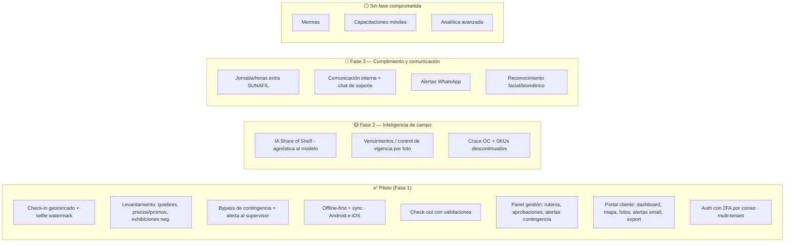

# 04 — Módulos y Funcionalidades

Volver a [[Market Track]] · Fuente: [[APP de levantamiento]]

> Mapeo de cada módulo del documento del cliente a funcionalidad concreta, con su prioridad de implementación. La columna **MVP** marca lo que entra en el **piloto** (ver [[05 - Fases de Desarrollo]] y [[06 - Análisis de Costos y Cobro]]).
>
> **Fuente contractual:** `Propuesta Maracumango.pdf` (aceptada, 23 jun 2026). El corte de fases futuras sigue la agrupación de la propuesta: **Fase 2 — Inteligencia de campo** y **Fase 3 — Cumplimiento y comunicación**.

Leyenda: ✅ MVP/piloto · 🟡 Fase 2 — Inteligencia de campo · 🔵 Fase 3 — Cumplimiento y comunicación · ⚪ Sin fase comprometida (se cotiza si el cliente lo pide)

---

## Aclaración del cliente — julio 2026: cliente ≠ marca

Dos hechos que el modelo no recogía, y que cambian el núcleo:

1. **El `tenant` es el CLIENTE, no la marca.** Un cliente puede comercializar
   varias marcas (Oster, Sharpie…). El SKU cuelga de la **marca**.
2. **El mercaderista es exclusivo de un cliente**, y audita en cada tienda
   **todas las marcas de ese cliente** que allí se vendan.

Como cada marca vive en un **pasillo distinto**, una **visita** produce **un
levantamiento por marca**: su foto "Antes", su Share of Shelf, sus exhibiciones y
su foto "Después".

> **El piloto tiene una sola marca**, así que la app se ve exactamente igual que
> antes: una visita, un levantamiento. Por eso se modela ahora — cuesta nada hoy
> y sería reescribir el núcleo transaccional el día que entre un cliente con tres
> marcas.

Y una regla nueva: **si un cliente cancela el servicio, sus mercaderistas pierden
el acceso** — incluida la réplica local de sus teléfonos, que se purga al
sincronizar. Ver [[03 - Modelo de Datos]].

---

## Revisión con el cliente — julio 2026

Siete cambios acordados **después** de la propuesta aceptada. Todos entran al
piloto y ya están reflejados en las tablas de abajo, en
[[03 - Modelo de Datos]] y en los prompts de diseño ([[10 - Brief de Diseño UI]]).

| # | Cambio | Dónde impacta |
|---|---|---|
| 1 | **OTP por SMS y WhatsApp**, habilitables/deshabilitables desde el panel. El correo sigue siendo el default | Auth · proveedor externo · costo por mensaje |
| 2 | **Pase de acceso temporal** desde el panel para el usuario que no recibe su OTP | Auth · nueva tabla · panel |
| 3 | **Radio de geocerca por defecto: 100 m** (antes 50 m) | `tienda.radio_geocerca_m` |
| 4 | **"Caras" pasa a llamarse "frentes"** en toda la UI y el modelo | Glosario · esquema · copy |
| 5 | **Share of Shelf por SKU** (además del agregado de góndola) **con foto opcional** | `levantamiento_sku` · wizard móvil · volumen de fotos |
| 6 | **"Quiebres y diferencias"**: además del quiebre se marca la **diferencia** (piso > 0 y piso ≠ sistema) | `levantamiento_sku` · motor de alertas |
| 7 | **Ayuda contextual** (`?`) en cada paso de la app y cada sección del panel y el portal | Los tres productos |

**Tres consecuencias que conviene tener presentes:**

- **El radio de 100 m debilita el candado anti-*fake GPS*.** Duplicar el radio
  cuadruplica el área válida: en un centro comercial denso, 100 m pueden abarcar
  la tienda de al lado o el estacionamiento. Es una decisión del cliente
  (probablemente por deriva del GPS en interiores), no un error — pero es un
  argumento de venta que se atenúa, y el radio es editable **por tienda**: lo
  correcto es bajarlo donde la geografía lo permita.
- **El SOS por SKU alarga el paso más largo del wizard.** Con 15–25 SKUs
  codificados, capturar frentes propios y de competencia SKU por SKU multiplica
  el tiempo en góndola. Por eso la foto es **opcional** y el detalle por SKU
  debe poder recorrerse rápido (lista con steppers, no una pantalla por SKU).
  Es lo primero que hay que medir en las pruebas de campo.
- **El OTP asume conectividad.** Un mercaderista sin señal no recibe código por
  ningún canal. Mitigación ya prevista: la sesión persiste en el dispositivo y
  el 2FA no se repite cada día; el pase temporal cubre el resto.

---

## App móvil (mercaderista)

> Disponible en **Android e iOS** (mismo código React Native + Expo; builds vía EAS). Distribución del piloto: APK por **enlace directo desde el panel de gestión** (Android) y **TestFlight** (iOS) — la publicación en tiendas depende de sus tiempos de aprobación y no está garantizada.

### Módulo 1 — Check-in (geocercas y control laboral)
| Función | MVP |
|---|---|
| Apertura de app y selección de tienda del rutero | ✅ |
| **Geocerca**: bloqueo de check-in fuera del radio de la tienda — **default 100 m**, editable por tienda (anti *fake GPS*) | ✅ |
| **Selfie con watermark** (hora + coordenadas), galería bloqueada | ✅ |
| Marcación de entrada con hora de **servidor** | ✅ |
| Reconocimiento facial / biométrico | 🔵 |

### Módulo 2 — Levantamiento de información (secuencial, sin saltos)
| Paso | Función | MVP |
|---|---|---|
| 2.1 | Foto "Antes" de la góndola | ✅ |
| 2.1 | **Share of Shelf**: conteo de **frentes** propios vs competencia — **agregado de góndola + detalle por SKU**, con **foto opcional por SKU** | ✅ manual · 🟡 IA por foto |
| 2.2 | Checklist de SKUs codificados por tienda | ✅ |
| 2.2 | **Quiebres y diferencias**: stock en sistema vs piso → flag **quiebre** (piso = 0 y sistema > 0) y flag **diferencia** (piso > 0 y piso ≠ sistema), cada uno con su alerta | ✅ |
| 2.2 | Cruce automático con órdenes de compra en tránsito / SKUs inactivos | 🟡 |
| 2.3 | Digitación de precio del cliente (no competencia) | ✅ |
| 2.3 | **Motor de alertas de precio** (regular/promo, comunicada, tolerancia) | ✅ |
| 2.4 | Exhibiciones negociadas (instalada, unidades, foto) | ✅ |
| 2.4 | Material POP | ✅ |
| 2.4 | Exhibiciones adicionales (crear, tipo, foto, vigencia) | 🟡 |
| 2.5 | Foto "Después" | ✅ |
| — | **Mecanismo de contingencia (bypass)**: si un paso no se puede completar por causa externa (sin acceso al almacén, información no disponible), el mercaderista registra el hallazgo y continúa; se genera una **alerta en tiempo real** al supervisor en el panel | ✅ |

> El levantamiento es secuencial y obligatorio, pero **no un bloqueo absoluto**: el bypass justificado + alerta es parte del alcance contractual del piloto.

### Módulo 3 — Check-out
| Función | MVP |
|---|---|
| **Validación de tareas pendientes** (bloqueo si falta foto/reporte) | ✅ |
| Bitácora / comentarios libres | ✅ |
| Marcación de salida con GPS | ✅ |
| Modo tránsito (tiempo de traslado entre tiendas) | ✅ básico · 🟡 métrica por km/ciudad |

### Transversal móvil
| Función | MVP |
|---|---|
| **Modo offline** (operar sin señal, sync diferida) | ✅ **crítico** |
| Compresión de fotos en cliente | ✅ |
| Push de tareas nuevas del supervisor | ✅ |
| App para **Android e iOS** (mismo código base) | ✅ |
| **Distribución por enlace directo** desde el panel (APK Android; TestFlight en iOS) | ✅ |
| **Ayuda contextual** (`?`) en cada paso del levantamiento y en check-in/check-out | ✅ |

### Seguridad (todas las plataformas)
| Función | MVP |
|---|---|
| Autenticación usuario/contraseña + **segundo factor por correo electrónico** | ✅ |
| **Segundo factor por SMS y WhatsApp** — canales adicionales, habilitables/deshabilitables desde el panel | ✅ |
| **Pase de acceso temporal** emitido desde el panel para el usuario que no recibe su OTP (un solo uso, 15 min, auditado) | ✅ |
| Aislamiento de datos por cliente-marca (multi-tenant, RLS) | ✅ |
| Actualizaciones remotas OTA sin reinstalar (EAS Updates) | ✅ |

> El correo sigue siendo el canal por defecto — es lo que fija la propuesta
> aceptada. SMS y WhatsApp **se suman** como canales elegibles, no lo
> reemplazan. Ambos cuestan por mensaje enviado (ver
> [[06 - Análisis de Costos y Cobro]]) y dependen de un proveedor externo aún
> por validar en el spike de segundo factor.

---

## Módulos transversales de negocio

### Mermas (protección de activos)
| Función | MVP |
|---|---|
| Tipificación (manipulación / transporte / vencimiento) | ⚪ |
| Evidencia: código de barras + daño | ⚪ |
| Cargo digital (nombre del encargado que recibe) | ⚪ |

> *Nota:* la propuesta aceptada **no compromete mermas en ninguna fase** — quedó fuera del piloto y de las fases 2/3. Es un módulo autocontenido, vendible como adición cotizada aparte.

### Vencimientos — PVPS/FEFO (semáforo)
| Función | MVP |
|---|---|
| Digitar lote + fecha de vencimiento | 🟡 |
| Semáforo verde/ámbar/rojo (job automático) | 🟡 |
| Acción comercial sugerida al cliente | 🟡 |

### Blindaje SUNAFIL
| Función | MVP |
|---|---|
| Autonomía de mando (órdenes solo vía supervisor en la app) | ✅ (es el modelo de roles) |
| Registro de herramientas/SCTR/fotocheck | 🔵 |
| **Corte automático de jornada** 8h/48h + aprobación de horas extra | 🔵 |

> El **modelo de roles** (solo el supervisor da órdenes) ya nace en el MVP por diseño. El control fino de jornada/horas extra es parte de la **Fase 3 — Cumplimiento y comunicación** de la propuesta.

---

## Panel de gestión (supervisor / admin)

| Función | MVP |
|---|---|
| Alta de **clientes**, sus **marcas**, cadenas, tiendas, SKUs, precios, promos (pre-carga) | ✅ |
| **Importación del Excel del cliente** — plantilla propia, vista previa con errores fila por fila, y aplicación transaccional (todo o nada) | ✅ |
| **Mapeador de columnas** — el cliente sube SU Excel y el admin mapea sus columnas una vez; el mapeo queda guardado | ✅ ⚠️ **alcance nuevo, fuera de la propuesta** |
| **Baja de un cliente** → sus mercaderistas pierden el acceso automáticamente (y la réplica local de sus teléfonos se purga al sincronizar) | ✅ |
| Diseño de **ruteros** y asignación a mercaderistas | ✅ |
| Asignación de tareas y seguimiento en tiempo real | ✅ |
| Aprobar / rechazar reportes de visitas | ✅ |
| Ver todas las visitas, evidencia fotográfica | ✅ |
| **Alertas de contingencia en tiempo real** (bypass del mercaderista) | ✅ |
| **Gestión de acceso**: canales de OTP activos + emisión de pases temporales, con bitácora de quién lo emitió y por qué | ✅ |
| **Ayuda contextual** (`?`) en cada sección | ✅ |
| Comunicación interna (comunicados, confirmación de lectura) + chat de soporte | 🔵 |
| Capacitaciones móviles | ⚪ |

---

## Portal del cliente (Brand Manager)

| Función | MVP |
|---|---|
| Login multi-tenant (solo ve su marca) | ✅ |
| **Dashboard de KPIs** (cumplimiento de rutero, quiebres, SOS, exhibiciones) | ✅ |
| **Mapa en tiempo real** con pines verde/rojo | ✅ |
| Galería de fotos antes/después por tienda | ✅ |
| **Alertas automáticas por email** (quiebre, desviación de precio) | ✅ |
| Exportación de reportes (Excel/CSV/PDF) | ✅ |
| **Ayuda contextual** (`?`) en cada sección | ✅ |
| Alertas por **WhatsApp** | 🔵 |
| KPIs por mercaderista / supervisor / tienda (cortes avanzados) | ✅ básicos · 🟡 avanzados |

> **Ojo con el WhatsApp:** las *alertas* por WhatsApp siguen en Fase 3. Lo que
> entra al piloto es el **OTP** por WhatsApp, que es otro caso de uso (plantilla
> de autenticación) aunque comparta proveedor. Habilitar uno no habilita el otro.

---

## Los 3 argumentos de licitación (del documento)

El "Trípode de Seguridad" que el cliente quiere mostrar en su presentación:

1. **Dashboard en tiempo real** (mapa de pines) → ✅ MVP.
2. **Alertas automatizadas** (email MVP → WhatsApp fase 3) → ✅/🔵.
3. **Cero consumo de datos / Offline Mode** → ✅ MVP (diferenciador #1).

Y el "Trípode" comercial: **Control de Mermas** ⚪ · **Alertas PVPS** 🟡 · **Cumplimiento SUNAFIL** ✅/🔵.

> Para el **piloto**, el mensaje de venta se sostiene con: offline real + check-in geocercado + levantamiento de quiebres/precios con bypass de contingencia + dashboard con mapa y alertas por email. PVPS/IA de SOS (Fase 2) y SUNAFIL/WhatsApp (Fase 3) refuerzan la propuesta como evolución pagada; mermas se cotiza aparte si el cliente lo pide.

---

## Resumen de corte MVP vs futuro

---

⬅ [[03 - Modelo de Datos]] · Siguiente: [[05 - Fases de Desarrollo]]
