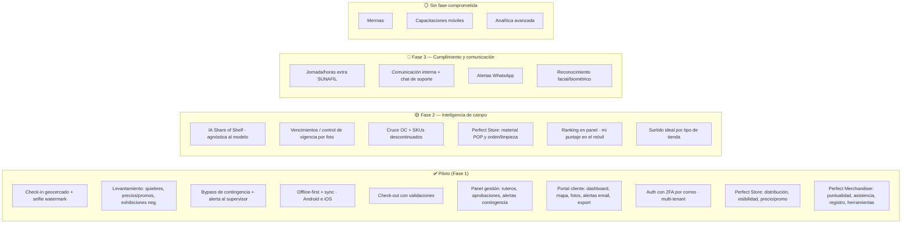

# 04 — Módulos y Funcionalidades

Volver a [[Market Track]] · Fuente: [[APP de levantamiento]]

> Mapeo de cada módulo del documento del cliente a funcionalidad concreta, con su prioridad de implementación. La columna **MVP** marca lo que entra en el **piloto** (ver [[05 - Fases de Desarrollo]] y [[06 - Análisis de Costos y Cobro]]).
>
> **Fuente contractual:** `Propuesta Maracumango.pdf` (aceptada, 23 jun 2026). El corte de fases futuras sigue la agrupación de la propuesta: **Fase 2 — Inteligencia de campo** y **Fase 3 — Cumplimiento y comunicación**.

Leyenda: ✅ MVP/piloto · 🟡 Fase 2 — Inteligencia de campo · 🔵 Fase 3 — Cumplimiento y comunicación · ⚪ Sin fase comprometida (se cotiza si el cliente lo pide)

---

## Aclaración del cliente — julio 2026: cliente ≠ marca

Dos hechos que el modelo no recogía, y que cambian el núcleo:

1. **El `tenant` es el CLIENTE, no la marca.** Un cliente puede comercializar
   varias marcas (Oster, Sharpie…). El SKU cuelga de la **marca**.
2. **El mercaderista es exclusivo de un cliente**, y audita en cada tienda
   **todas las marcas de ese cliente** que allí se vendan.

Como cada marca vive en un **pasillo distinto**, una **visita** produce **un
levantamiento por marca**: su foto "Antes", su Share of Shelf, sus exhibiciones y
su foto "Después".

> **El piloto tiene una sola marca**, así que la app se ve exactamente igual que
> antes: una visita, un levantamiento. Por eso se modela ahora — cuesta nada hoy
> y sería reescribir el núcleo transaccional el día que entre un cliente con tres
> marcas.

Y una regla nueva: **si un cliente cancela el servicio, sus mercaderistas pierden
el acceso** — incluida la réplica local de sus teléfonos, que se purga al
sincronizar. Ver [[03 - Modelo de Datos]].

---

## Revisión con el cliente — julio 2026

Siete cambios acordados **después** de la propuesta aceptada. Todos entran al
piloto y ya están reflejados en las tablas de abajo, en
[[03 - Modelo de Datos]] y en los prompts de diseño ([[10 - Brief de Diseño UI]]).

| # | Cambio | Dónde impacta |
|---|---|---|
| 1 | **OTP por SMS y WhatsApp**, habilitables/deshabilitables desde el panel. El correo sigue siendo el default | Auth · proveedor externo · costo por mensaje |
| 2 | **Pase de acceso temporal** desde el panel para el usuario que no recibe su OTP | Auth · nueva tabla · panel |
| 3 | **Radio de geocerca por defecto: 100 m** (antes 50 m) | `tienda.radio_geocerca_m` |
| 4 | **"Caras" pasa a llamarse "frentes"** en toda la UI y el modelo | Glosario · esquema · copy |
| 5 | **Share of Shelf por SKU** (además del agregado de góndola) **con foto opcional** | `levantamiento_sku` · wizard móvil · volumen de fotos |
| 6 | **"Quiebres y diferencias"**: además del quiebre se marca la **diferencia** (piso > 0 y piso ≠ sistema) | `levantamiento_sku` · motor de alertas |
| 7 | **Ayuda contextual** (`?`) en cada paso de la app y cada sección del panel y el portal | Los tres productos |

**Tres consecuencias que conviene tener presentes:**

- **El radio de 100 m debilita el candado anti-*fake GPS*.** Duplicar el radio
  cuadruplica el área válida: en un centro comercial denso, 100 m pueden abarcar
  la tienda de al lado o el estacionamiento. Es una decisión del cliente
  (probablemente por deriva del GPS en interiores), no un error — pero es un
  argumento de venta que se atenúa, y el radio es editable **por tienda**: lo
  correcto es bajarlo donde la geografía lo permita.
- **El SOS por SKU alarga el paso más largo del wizard.** Con 15–25 SKUs
  codificados, capturar frentes propios y de competencia SKU por SKU multiplica
  el tiempo en góndola. Por eso la foto es **opcional** y el detalle por SKU
  debe poder recorrerse rápido (lista con steppers, no una pantalla por SKU).
  Es lo primero que hay que medir en las pruebas de campo.
- **El OTP asume conectividad.** Un mercaderista sin señal no recibe código por
  ningún canal. Mitigación ya prevista: la sesión persiste en el dispositivo y
  el 2FA no se repite cada día; el pase temporal cubre el resto.

---

## Segunda revisión con el cliente — julio 2026

Ocho peticiones nuevas del cliente, posteriores a la primera revisión. Cinco son
alcance nuevo (fuera de la propuesta aceptada) que **entra al piloto** por
decisión del cliente; tres son refinamientos de alcance ya comprometido. Todas
están en Linear y reflejadas en las tablas de abajo.

| # | Petición | Disposición | Dónde impacta |
|---|---|---|---|
| 1 | **Solicitud de cambio de ruta** desde la app (con motivo) que el supervisor ve y resuelve en el panel | ✅ nuevo al piloto | nueva tabla `solicitud_cambio_ruta` · app · panel supervisor |
| 2 | **Fotos ≤ 2 MB** (tope duro) | ✅ refinamiento | compresión ya prevista; el objetivo sigue en ~300 KB |
| 3 | El admin **edita el formulario** que ven los mercaderistas — *constructor completo* (schema-driven) | ✅ nuevo al piloto | reformula el wizard fijo · modelo de formularios versionados · panel · app |
| 4 | **Cluster** configurable por cliente (AAA/AA/A/B…) | ✅ refinamiento | es clasificación de **tienda**; `tienda.cluster` ya existe → catálogo editable por cliente |
| 5 | **Departamento, ciudad, distrito, dirección** en el alta de tienda | ✅ refinamiento | `tienda` (faltan departamento/provincia/distrito) · panel · importador |
| 6 | El mercaderista **registra exhibiciones conseguidas** por él | ✅ pasa de 🟡 a piloto | `exhibicion.tipo_adicional` ya lo soporta · paso 2.4 del wizard |
| 7 | Planeación de rutas **mensual**, no solo semanal | ✅ refinamiento | vista de calendario sobre los ruteros diarios · panel |
| 8 | Activar/desactivar **módulos del portal cliente** por cada cliente | ✅ nuevo al piloto | config por tenant · panel (toggle) · portal (enforcement) |

> **Cluster (4):** el cliente lo describió como "tipo de marca/cliente", pero
> AAA/AA/A/B es el estándar de clasificación del **punto de venta** por nivel —
> justo lo que ya modela `tienda.cluster`. Se implementa sobre la tienda con la
> lista de valores editable por cliente. (Pendiente de confirmar si además
> querían clasificar la marca/cliente.)
>
> **Dirección (5):** la jerarquía administrativa oficial de Perú es
> departamento > provincia > distrito. Se modela `provincia` y se etiqueta
> "Ciudad/Provincia" en la UI (pendiente de confirmar con el cliente si
> prefieren un campo "ciudad" literal).
>
> **Editor de formulario (3):** el "constructor completo" reformula el wizard hoy
> fijo y secuencial. La secuencia obligatoria, la contingencia (bypass) y los
> campos derivados (quiebre/diferencia/SOS) siguen siendo del núcleo — el
> formulario configura presentación y campos libres, no reescribe reglas de
> negocio.

---

## Tercera revisión con el cliente — agosto 2026

Reunión del **3 ago 2026**. El cliente pidió **dos métricas** que el sistema no
medía y que cambian para qué sirve el producto. Es alcance nuevo, fuera de la
propuesta aceptada. La tabla de más abajo desglosa esas dos peticiones en las 16
piezas que hay que construir — no son 16 cosas que pidiera el cliente.

- **Perfect Store** — cómo de bien está ejecutada la marca en una tienda. Es lo
  que el cliente le vende a la marca: *"te ofrezco medirte Perfect Store en Perú,
  que hoy nadie te lo hace"*.
- **Perfect Merchandiser** — un plan de lealtad que puntúa al mercaderista
  **solo por lo que él controla**. Perfect Store no sirve para evaluarlo: *"si el
  tipo es el encargado de las tiendas de provincia que son más chiquitas, nunca
  le va a poder competir al que trabaja en la tienda más grande"*.

### Perfect Store — las 5 variables

El **peso y el objetivo de cada variable los fija la marca**, no nosotros:
*"la marca es la que tiene que alinearnos"*. La ponderación se afina por
**categoría de producto y tipo de tienda**: *"no es por SKU, es por categoría,
por tipo tienda"*.

| # | Variable | Cómo se mide | Fase |
|---|---|---|---|
| 1 | **Distribución / disponibilidad** | % de SKUs presentes vs. el surtido ideal de esa tienda | ✅ |
| 2 | **Visibilidad** | share of shelf real vs. objetivo, 0–100 con tope en 100 | ✅ |
| 3 | **Precio y promoción** | SKUs dentro de tolerancia / evaluados × 100 | ✅ |
| 4 | **Material POP y activación** | presencia y estado de lo comprometido | 🟡 |
| 5 | **Orden y limpieza** | escala cualitativa de 3 niveles **con foto** | 🟡 |

Las tres primeras se calculan sobre datos que **ya se capturan** hoy en el
levantamiento — *"las tres primeras ya las tenemos"*.

### Perfect Merchandiser — las 5 variables

| # | Variable | Cómo se mide | Fase |
|---|---|---|---|
| 1 | **Puntualidad** | desvío contra la hora planificada de la parada | ✅ |
| 2 | **Asistencia** | la parada se visitó o no — *"una cosa es que llegues tarde, pero otra cosa es que ni siquiera llegues"* | ✅ |
| 3 | **Tiempo efectivo de atención** | ⚠️ **sin fórmula acordada** (ver abajo) | 🔸 andamiaje, llega desactivada |
| 4 | **Calidad de registro** | completitud de campos y fotos presentes | ✅ |
| 5 | **Herramientas de trabajo** | checklist del check-in | ✅ |

> 🔸 no es una fase: la variable 3 se construye en el piloto pero **nace apagada**
> porque nadie ha acordado cómo se mide. Encenderla no requiere desarrollo nuevo,
> requiere una decisión.

### Las dos peticiones, desglosadas en 16 piezas

| # | Pieza | Disposición | Dónde impacta |
|---|---|---|---|
| 1 | **Categoría de producto** en el catálogo | ✅ nuevo al piloto | `categoria` + `sku.categoria_id` · panel · importador |
| 2 | **Hora planificada** por parada | ✅ nuevo al piloto | `rutero_parada.hora_planificada` · derivados en base |
| 3 | **Configuración de Perfect Store** por marca/categoría/tipo de tienda | ✅ nuevo al piloto | tabla de config versionada · panel |
| 4 | **Motor de puntaje** (distribución, visibilidad, precio/promo) | ✅ nuevo al piloto | vista/función + `test:db` |
| 5 | **Ponderado total y agregados** por categoría, tipo de tienda y periodo | ✅ nuevo al piloto | núcleo · alimenta panel y portal |
| 6 | **Check-in con checklist** de herramientas | ✅ nuevo al piloto | formulario configurable extendido al check-in · app |
| 7 | **Motor Perfect Merchandiser** | ✅ nuevo al piloto | puntaje por mercaderista y periodo · niveles de bono |
| 8 | **Portal: Perfect Store con drill-down** y evolución | ✅ nuevo al piloto | portal cliente |
| 9 | **docs de esta revisión** | ✅ | este documento · `03` · ADR-0011 |
| 10 | **Material POP y activación** ampliados | 🟡 | `exhibicion` ampliada · 4ª variable |
| 11 | **Orden y limpieza** con escala cualitativa | 🟡 | paso configurable + foto · 5ª variable |
| 12 | **Panel: configurar** Perfect Store y niveles de bono | 🟡 | panel admin |
| 13 | **Panel: ranking** de mercaderistas con desglose | ✅ | panel |
| 14 | **Móvil: mi puntaje** y mi posición | 🟡 | app · sync rules |
| 15 | **Surtido ideal** por tipo de tienda (plantilla) | 🟡 | panel · expande `tienda_sku` |
| 16 | **Publicar el prototipo** navegable para el cliente | 🟡 | compromiso de Diego en la reunión |

> **Consecuencia de este corte:** con las variables 4 y 5 en 🟡, **Perfect Store
> entra al piloto con 3 de sus 5 variables**. La ponderación renormaliza sobre
> las evaluadas, así que el número no queda inflado ni hundido — pero no es el
> Perfect Store completo que se le describió a la marca. Qué hacer con eso es una
> decisión abierta; está abajo.

### Decisiones cerradas en la reunión

**Orden y limpieza no la puntúa el mercaderista.** Nada de que se ponga nota a sí
mismo — *"es juez y parte"*. Escala cualitativa de tres niveles (bien / regular /
mal) **siempre con foto**, para que el supervisor pueda auditarla. Lo que vale
cada nivel es configuración.

**La calificación automática por imagen queda fuera del piloto.** Necesita un set
de fotos modelo por tipo de tienda que hoy no existe. Lo que sí se hace ahora es
**acumular la evidencia** para poder entrenarlo después.

**La foto del checklist de herramientas es opcional a propósito.** No tenerlas
equivale a no fotografiarlas, así que la ausencia de foto ya descuenta: se ahorra
un paso de calificación manual sin bloquear el flujo de campo.

**El ranking completo no baja al teléfono.** Cada mercaderista ve *su* puntaje y
*su* posición — *"si tú lo quieres compartir, es otra historia"*. Es una decisión
de producto con consecuencia técnica: ver [[03 - Modelo de Datos]] para qué
implica en las reglas de sincronización.

**Un puntaje ya calculado conserva la configuración con la que se calculó**, y
**una variable no evaluada renormaliza el peso en vez de puntuar cero**. Las dos
invariantes viven en [[03 - Modelo de Datos]], "Entidades añadidas tras la 3ª
revisión", que es donde se modelan.

### Decisiones abiertas — no las inventamos

**Cómo se mide el tiempo efectivo de atención.** El propio cliente lo dejó sin
cerrar: *"no sé cómo medirlo realmente y también tengo miedo porque puede ser un
incentivo perverso de que haga todo mal y rápido… ahí hay que pensar un poquito
más"*. Se construye el andamiaje y la variable llega **desactivada por defecto**.
No se inventa una fórmula: hace falta acordarla.

**Si el material POP suma dentro del tope de 100 o por encima.** *"Igual podrías
tener 100 puntos de perfect store y esto te suma y te lleva a 110."* Se define
**con cada marca**, así que el modelo lo soporta como configuración
(`dentro_del_tope` | `bonus_sobre_100`) y no se fija aquí una respuesta.

**La unidad del share of shelf.** Frentes o centímetros — *"ahí se mide por
frentes o se mide por distancia real"*. También es configuración por marca.

**Si el piloto sale con Perfect Store a 3 de 5 variables.** Consecuencia directa
del corte de arriba, y la única de estas cuatro que **no** la dejó abierta el
cliente: la abrimos nosotros al priorizar. O se acepta presentar el puntaje
incompleto —diciéndolo—, o las peticiones 10 y 11 suben a ✅ antes del piloto.
Conviene resolverlo antes de enseñarle el primer número a la marca.

> Dónde se calculan los puntajes y por qué no en el código de las apps:
> [ADR-0011](adr/0011-puntajes-derivados-en-la-base.md).

---

## App móvil (mercaderista)

> Disponible en **Android e iOS** (mismo código React Native + Expo; builds vía EAS). Distribución del piloto: APK por **enlace directo desde el panel de gestión** (Android) y **TestFlight** (iOS) — la publicación en tiendas depende de sus tiempos de aprobación y no está garantizada.

### Módulo 1 — Check-in (geocercas y control laboral)
| Función | MVP |
|---|---|
| Apertura de app y selección de tienda del rutero | ✅ |
| **Geocerca**: bloqueo de check-in fuera del radio de la tienda — **default 100 m**, editable por tienda (anti *fake GPS*) | ✅ |
| **Selfie con watermark** (hora + coordenadas), galería bloqueada | ✅ |
| Marcación de entrada con hora de **servidor** | ✅ |
| Reconocimiento facial / biométrico | 🔵 |

### Módulo 2 — Levantamiento de información (secuencial, sin saltos)
| Paso | Función | MVP |
|---|---|---|
| 2.1 | Foto "Antes" de la góndola | ✅ |
| 2.1 | **Share of Shelf**: conteo de **frentes** propios vs competencia — **agregado de góndola + detalle por SKU**, con **foto opcional por SKU** | ✅ manual · 🟡 IA por foto |
| 2.2 | Checklist de SKUs codificados por tienda | ✅ |
| 2.2 | **Quiebres y diferencias**: stock en sistema vs piso → flag **quiebre** (piso = 0 y sistema > 0) y flag **diferencia** (piso > 0 y piso ≠ sistema), cada uno con su alerta | ✅ |
| 2.2 | Cruce automático con órdenes de compra en tránsito / SKUs inactivos | 🟡 |
| 2.3 | Digitación de precio del cliente (no competencia) | ✅ |
| 2.3 | **Motor de alertas de precio** (regular/promo, comunicada, tolerancia) | ✅ |
| 2.4 | Exhibiciones negociadas (instalada, unidades, foto) | ✅ |
| 2.4 | Material POP | ✅ |
| 2.4 | Exhibiciones adicionales / **conseguidas por el mercaderista** (crear, tipo, foto, vigencia) | ✅ |
| 2.5 | Foto "Después" | ✅ |
| — | **Mecanismo de contingencia (bypass)**: si un paso no se puede completar por causa externa (sin acceso al almacén, información no disponible), el mercaderista registra el hallazgo y continúa; se genera una **alerta en tiempo real** al supervisor en el panel | ✅ |

> El levantamiento es secuencial y obligatorio, pero **no un bloqueo absoluto**: el bypass justificado + alerta es parte del alcance contractual del piloto.

### Módulo 3 — Check-out
| Función | MVP |
|---|---|
| **Validación de tareas pendientes** (bloqueo si falta foto/reporte) | ✅ |
| Bitácora / comentarios libres | ✅ |
| Marcación de salida con GPS | ✅ |
| Modo tránsito (tiempo de traslado entre tiendas) | ✅ básico · 🟡 métrica por km/ciudad |

### Transversal móvil
| Función | MVP |
|---|---|
| **Modo offline** (operar sin señal, sync diferida) | ✅ **crítico** |
| Compresión de fotos en cliente (**≤ 2 MB por foto**, tope duro; objetivo ~300 KB) | ✅ |
| Push de tareas nuevas del supervisor | ✅ |
| **Solicitud de cambio de ruta** (con motivo, offline) al supervisor | ✅ |
| **Wizard de levantamiento configurable** (render del formulario editado en el panel) | ✅ |
| App para **Android e iOS** (mismo código base) | ✅ |
| **Distribución por enlace directo** desde el panel (APK Android; TestFlight en iOS) | ✅ |
| **Ayuda contextual** (`?`) en cada paso del levantamiento y en check-in/check-out | ✅ |

### Seguridad (todas las plataformas)
| Función | MVP |
|---|---|
| Autenticación usuario/contraseña + **segundo factor por correo electrónico** | ✅ |
| **Segundo factor por SMS y WhatsApp** — canales adicionales, habilitables/deshabilitables desde el panel | ✅ |
| **Pase de acceso temporal** emitido desde el panel para el usuario que no recibe su OTP (un solo uso, 15 min, auditado) | ✅ |
| Aislamiento de datos por cliente-marca (multi-tenant, RLS) | ✅ |
| Actualizaciones remotas OTA sin reinstalar (EAS Updates) | ✅ |

> El correo sigue siendo el canal por defecto — es lo que fija la propuesta
> aceptada. SMS y WhatsApp **se suman** como canales elegibles, no lo
> reemplazan. Ambos cuestan por mensaje enviado (ver
> [[06 - Análisis de Costos y Cobro]]) y dependen de un proveedor externo aún
> por validar en el spike de segundo factor.

---

## Módulos transversales de negocio

### Mermas (protección de activos)
| Función | MVP |
|---|---|
| Tipificación (manipulación / transporte / vencimiento) | ⚪ |
| Evidencia: código de barras + daño | ⚪ |
| Cargo digital (nombre del encargado que recibe) | ⚪ |

> *Nota:* la propuesta aceptada **no compromete mermas en ninguna fase** — quedó fuera del piloto y de las fases 2/3. Es un módulo autocontenido, vendible como adición cotizada aparte.

### Vencimientos — PVPS/FEFO (semáforo)
| Función | MVP |
|---|---|
| Digitar lote + fecha de vencimiento | 🟡 |
| Semáforo verde/ámbar/rojo (job automático) | 🟡 |
| Acción comercial sugerida al cliente | 🟡 |

### Blindaje SUNAFIL
| Función | MVP |
|---|---|
| Autonomía de mando (órdenes solo vía supervisor en la app) | ✅ (es el modelo de roles) |
| Registro de herramientas/SCTR/fotocheck | 🔵 |
| **Corte automático de jornada** 8h/48h + aprobación de horas extra | 🔵 |

> El **modelo de roles** (solo el supervisor da órdenes) ya nace en el MVP por diseño. El control fino de jornada/horas extra es parte de la **Fase 3 — Cumplimiento y comunicación** de la propuesta.

---

## Panel de gestión (supervisor / admin)

| Función | MVP |
|---|---|
| Alta de **clientes**, sus **marcas**, cadenas, tiendas, SKUs, precios, promos (pre-carga) | ✅ |
| Alta de tienda con **departamento, ciudad, distrito y dirección** | ✅ |
| **Cluster de tienda** configurable por cliente (catálogo de niveles editable) | ✅ |
| **Importación del Excel del cliente** — plantilla propia, vista previa con errores fila por fila, y aplicación transaccional (todo o nada) | ✅ |
| **Mapeador de columnas** — el cliente sube SU Excel y el admin mapea sus columnas una vez; el mapeo queda guardado | ✅ ⚠️ **alcance nuevo, fuera de la propuesta** |
| **Baja de un cliente** → sus mercaderistas pierden el acceso automáticamente (y la réplica local de sus teléfonos se purga al sincronizar) | ✅ |
| Diseño de **ruteros** (**semanal y mensual**) y asignación a mercaderistas | ✅ |
| **Bandeja de solicitudes de cambio de ruta** del mercaderista (ver, resolver, ajustar la planeación) | ✅ |
| **Editor de formularios del levantamiento** (constructor schema-driven que la app renderiza) | ✅ |
| **Módulos del portal cliente** activables/desactivables por cada cliente | ✅ |
| Asignación de tareas y seguimiento en tiempo real | ✅ |
| Aprobar / rechazar reportes de visitas | ✅ |
| Ver todas las visitas, evidencia fotográfica | ✅ |
| **Alertas de contingencia en tiempo real** (bypass del mercaderista) | ✅ |
| **Gestión de acceso**: canales de OTP activos + emisión de pases temporales, con bitácora de quién lo emitió y por qué | ✅ |
| **Ayuda contextual** (`?`) en cada sección | ✅ |
| Comunicación interna (comunicados, confirmación de lectura) + chat de soporte | 🔵 |
| Capacitaciones móviles | ⚪ |

---

## Portal del cliente (Brand Manager)

| Función | MVP |
|---|---|
| Login multi-tenant (solo ve su marca) | ✅ |
| **Dashboard de KPIs** (cumplimiento de rutero, quiebres, SOS, exhibiciones) | ✅ |
| **Mapa en tiempo real** con pines verde/rojo | ✅ |
| Galería de fotos antes/después por tienda | ✅ |
| **Alertas automáticas por email** (quiebre, desviación de precio) | ✅ |
| Exportación de reportes (Excel/CSV/PDF) | ✅ |
| **Ayuda contextual** (`?`) en cada sección | ✅ |
| Secciones del portal **habilitadas por cliente** (según la configuración del panel) | ✅ |
| Alertas por **WhatsApp** | 🔵 |
| KPIs por mercaderista / supervisor / tienda (cortes avanzados) | ✅ básicos · 🟡 avanzados |

> **Ojo con el WhatsApp:** las *alertas* por WhatsApp siguen en Fase 3. Lo que
> entra al piloto es el **OTP** por WhatsApp, que es otro caso de uso (plantilla
> de autenticación) aunque comparta proveedor. Habilitar uno no habilita el otro.

---

## Los 3 argumentos de licitación (del documento)

El "Trípode de Seguridad" que el cliente quiere mostrar en su presentación:

1. **Dashboard en tiempo real** (mapa de pines) → ✅ MVP.
2. **Alertas automatizadas** (email MVP → WhatsApp fase 3) → ✅/🔵.
3. **Cero consumo de datos / Offline Mode** → ✅ MVP (diferenciador #1).

Y el "Trípode" comercial: **Control de Mermas** ⚪ · **Alertas PVPS** 🟡 · **Cumplimiento SUNAFIL** ✅/🔵.

> Para el **piloto**, el mensaje de venta se sostiene con: offline real + check-in geocercado + levantamiento de quiebres/precios con bypass de contingencia + dashboard con mapa y alertas por email. PVPS/IA de SOS (Fase 2) y SUNAFIL/WhatsApp (Fase 3) refuerzan la propuesta como evolución pagada; mermas se cotiza aparte si el cliente lo pide.

---

## Resumen de corte MVP vs futuro

---

⬅ [[03 - Modelo de Datos]] · Siguiente: [[05 - Fases de Desarrollo]]
