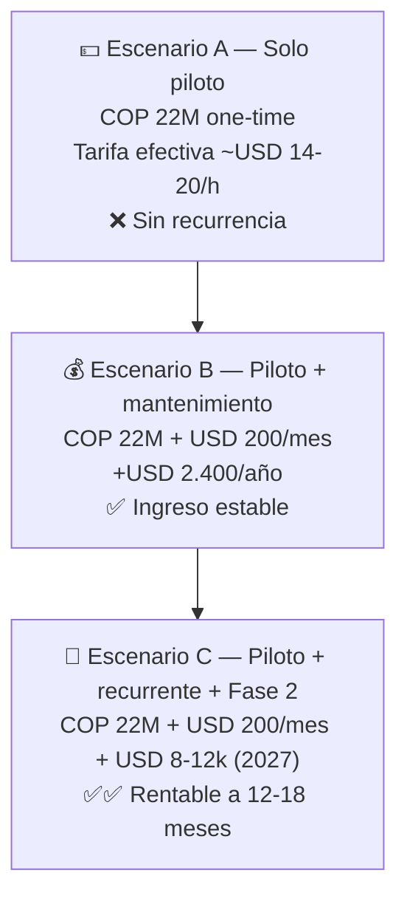

# 06 — Análisis de Costos y Cobro

Volver a [[Market Track]]

> **TL;DR:** El presupuesto del cliente (**COP 17–22M ≈ USD 5.000–7.000**) está **por debajo del valor de mercado** de esta plataforma. Es viable **solo** con un piloto de alcance recortado, hecho por ti + Claude Code, **sin contratar full-time**, con el **cloud a cuenta del cliente**, y conviene convertirlo en una **relación de largo plazo** (mantenimiento mensual + fases pagadas). Cobra el **tope del rango: COP ~22M (USD ~7.000)**.

Tipo de cambio de referencia: **USD 1 ≈ COP 3.150** (jun 2026).

---

## 1. Costos de infraestructura (cloud)

### Durante el desarrollo (jun–nov, ~5 meses)
| Servicio | USD/mes | 5 meses |
|---|---|---|
| Supabase Pro | 25 | 125 |
| PowerSync | 0–35 | 0–175 |
| Vercel | 0 | 0 |
| Cloudflare R2 | 0–5 | 0–25 |
| Expo EAS | 0–19 | 0–95 |
| Resend / Sentry | 0 | 0 |
| **Total desarrollo** | **~25–85** | **~125–420** |

### En operación (piloto, 20–50 mercaderistas)
| Concepto | USD/mes |
|---|---|
| Infra base (Supabase + PowerSync + Vercel) | 50–95 |
| Cloudflare R2 (fotos, crece) | 5–20 |
| Email / push | 0–20 |
| **OTP por SMS / WhatsApp** (canales nuevos, jul 2026) | **a estimar** |
| **Total operación** | **~55–135 USD/mes** + OTP |

> ⚠️ **Dos costos nuevos entran por la revisión con el cliente de julio 2026 y
> todavía no están cuantificados:**
>
> - **OTP por SMS/WhatsApp** — se cobra **por mensaje enviado** y el proveedor
>   está sin decidir (lo cierra el spike de segundo factor). El volumen es bajo
>   por diseño (la sesión persiste, el 2FA no se repite cada día), pero el costo
>   por SMS en Perú no es trivial y WhatsApp cobra por plantilla de
>   autenticación. Estimar antes de habilitar los canales.
> - **Fotos del Share of Shelf por SKU** — foto *opcional* por SKU, con 15–25
>   SKUs por visita. Si en campo resulta que se toman casi siempre, el volumen
>   de fotos se multiplica y R2 deja de ser el renglón de 5–20 USD/mes. Medirlo
>   en las pruebas de campo antes de comprometer un número.

> 🔑 **Decisión de negocio:** el cloud lo debe **pagar el cliente** (cuentas a su nombre, o reembolso mensual). En un proyecto de presupuesto ajustado, absorber USD 55–135/mes te comería el margen. El costo cloud **no es tu costo**, es del cliente.

---

## 2. Tu costo real (el tiempo)

Aunque cobras **por valor** y no por hora, necesitas ver tu **tarifa efectiva** para saber si el trato te conviene.

| Concepto | Estimación |
|---|---|
| Esfuerzo del MVP (solo dev + Claude Code) | **~350–500 h** |
| Periodo | ~22 semanas (≈ 18–25 h/sem efectivas) |
| Si cobras COP 22M (USD 7.000) | **USD 14–20 / hora** |
| Si cobras COP 17M (USD 5.400) | **USD 11–15 / hora** |

> Para un perfil senior full-stack con offline + IA, **USD 14–20/h es bajo** (mercado: USD 40–70/h). Para un mid en Colombia es aceptable-bajo. **Cobrando por valor, este proyecto te paga por debajo de tu valor de mercado.** Eso no lo hace mala decisión —puede ser estratégico (caso de éxito, entrada al nicho, recurrencia)— pero hay que tomarlo con los ojos abiertos.

---

## 3. Valor de mercado (con qué se compara el cliente)

| Referencia | Precio |
|---|---|
| App de retail execution **a medida** (MVP serio, LATAM) | **USD 25.000 – 80.000** |
| SaaS tipo **Repsly** | ~USD 39 / usuario / mes (≈ USD 1.560/mes para 40 usuarios) |
| SaaS tipo **Teamcore** | Enterprise (miles de USD/mes) |
| Freelance/agencia LATAM, app móvil offline + 2 webs + API | USD 20.000 – 50.000 |

**Conclusión:** el cliente está pidiendo un producto de **USD 25k+** por **USD 5–7k**. Tu ventaja para que el número cierre: Claude Code (multiplicador 2,5–3×), alcance recortado y reutilización de tus patrones (Supabase, Next.js, Expo). Aun así, **estás dejando dinero sobre la mesa** vs. el mercado.

---

## 4. ¿Contratar a alguien? — el número no da

Costo de un apoyo freelance en Colombia:
| Perfil | COP/mes | USD/mes |
|---|---|---|
| Junior front | 3–5M | ~1.000–1.600 |
| Mid full-stack | 6–9M | ~1.900–2.900 |

- Contratar a alguien **3 meses** = **USD 3.000–8.700** → **se come todo o más que tu fee** (USD 5–7k).
- **Veredicto:** con este presupuesto **no es viable contratar full-time**. Si el plazo aprieta, contrata **puntual y acotado** (diseño UI del portal, maquetación de dashboards, QA de Fase 4) por **máximo USD 500–1.000 total**, sabiendo que reduce tu margen. **Antes de contratar, recorta alcance** (mueve módulos 🟡 a Fase 2 pagada).

---

## 5. Recomendación de cobro

### 5.1 Precio del piloto
**Cobra el tope del rango: COP 22M (≈ USD 7.000)**, no el piso. Justificación:
- Es un trabajo de USD 25k+ a precio de USD 7k; cobrar el tope es lo mínimo razonable.
- El cliente ya tiene ese número en la cabeza → no hay fricción.
- **Blinda el alcance por contrato**: solo lo marcado ✅ en [[04 - Módulos y Funcionalidades]]. Todo lo demás se cotiza aparte.
- **Cloud a cuenta del cliente** (no incluido en el fee).

### 5.2 Forma de pago sugerida
| Hito | % | Monto (COP) | Cuándo |
|---|---|---|---|
| Anticipo (Fase 0) | 30% | ~6,6M | A la firma |
| Fin Fase 2 (levantamiento demo) | 30% | ~6,6M | ~8 sep |
| Fin Fase 4 (app probada) | 25% | ~5,5M | ~10 nov |
| Go-live piloto | 15% | ~3,3M | ~21 nov |

> El anticipo del 30% cubre tu infra inicial y filtra clientes serios. Pagar por hitos protege tu flujo de caja en un proyecto largo.

### 5.3 El verdadero negocio: lo recurrente y las fases
El piloto one-time a USD 7k **no es rentable como hecho aislado**. Lo vuelves rentable convirtiéndolo en relación:

| Línea de ingreso | Propuesta | Valor |
|---|---|---|
| **Mantenimiento mensual** | Soporte + hosting gestionado + correcciones + OTA | **USD 150–300/mes** |
| **Onboarding por nueva marca** | Cada cliente-marca nuevo de la outsourcing = setup pagable | **USD 800–1.500 c/u** |
| **Fase 2 (pagada)** | IA Share of Shelf, mermas, PVPS, WhatsApp, jornada SUNAFIL | **USD 6.000–12.000** |
| **Por mercaderista activo** (opcional) | Modelo de uso si crece la operación | USD 2–4 / merc. / mes |

> Aunque elegiste **proyecto cerrado**, **deja firmado desde ya** el mantenimiento mensual y la opción de Fase 2. Es lo que transforma un proyecto poco rentable en una cuenta que paga durante años. **Recomendación fuerte: no cierres el piloto sin un contrato de mantenimiento anexo.**

---

## 6. Escenarios

| Escenario | Año 1 (USD aprox.) | Veredicto |
|---|---|---|
| A — Solo piloto | ~7.000 | Apenas cubre costo; útil solo como portafolio |
| B — Piloto + mantenimiento | ~9.400 | Aceptable; ingreso recurrente |
| C — Piloto + mantenimiento + Fase 2 | ~17.000–21.000 | **Recomendado** — alcanza valor de mercado |

---

## 7. Cómo justificar el precio ante el cliente (anclaje al valor)

No vendas "horas de desarrollo", vende **lo que les ahorra/genera**:
- **Una sola multa de SUNAFIL** por desnaturalización u horas extra puede superar largamente los COP 22M.
- **Ganar una licitación** con la marca gracias al dashboard + offline vale mucho más que el fee.
- **Un quiebre de stock no detectado** un fin de semana = ventas perdidas que la app evita con alertas.
- El software es **CAPEX único**; reemplaza reportes en papel/WhatsApp sin trazabilidad.

> Mensaje: *"Por el costo de evitar una sola multa, tienen una plataforma que blinda su operación, gana licitaciones y profesionaliza el servicio."*

---

## 8. Recomendación final

1. **Cobra COP 22M (USD ~7.000)** por el piloto, no el piso del rango.
2. **Blinda el alcance** al MVP ✅ de [[04 - Módulos y Funcionalidades]]; todo lo demás, cotización aparte.
3. **Cloud a cuenta del cliente** (no en tu fee).
4. **No contrates full-time**; recorta alcance antes que contratar. Apoyo puntual máx. USD 500–1.000.
5. **Pago por hitos** (30/30/25/15) con anticipo a la firma.
6. **Cierra desde ya el mantenimiento mensual** (USD 150–300) y deja cotizada la Fase 2. Ahí está el negocio real.
7. Trátalo como **inversión estratégica**: caso de éxito + entrada al nicho de outsourcing de mercaderismo + recurrencia, no como un one-time rentable por sí solo.
8. **Gestiona la expectativa vs. LiveTrade** ([[07 - Benchmark LiveTrade (Overall)]]): el cliente compara contra una **suite BI madura de Overall** (Sell Out, Market Share, Web Scraping, integración SAP — años de trabajo). Deja por escrito que el piloto entrega la **capa de captura de campo + dashboards propios** (Tracking, Photogram, quiebres, precios, actividades), **no** la capa de inteligencia comercial integrada. Esa capa B es cotización aparte y futura. Confundir ambas es el mayor riesgo de que el proyecto "nunca termine".

---

⬅ [[05 - Fases de Desarrollo]] · Volver a [[Market Track]]
